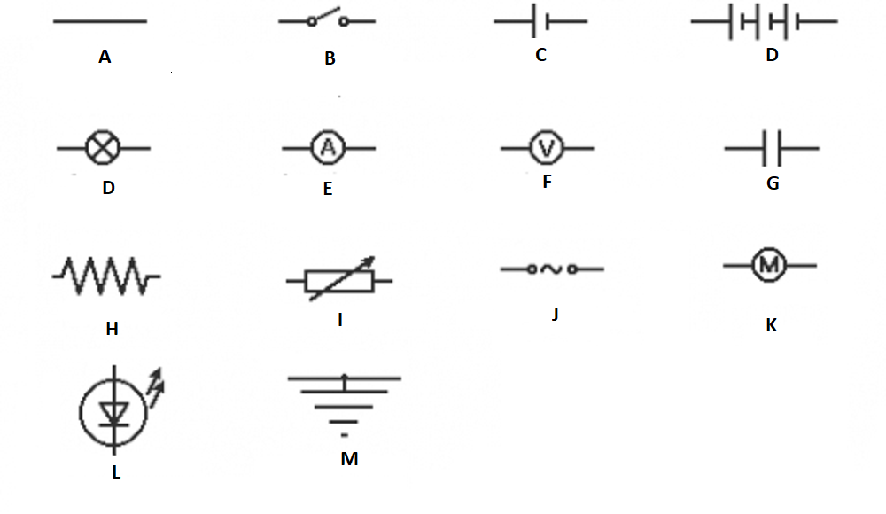

## :trophy: C1.1 Reto en clase

Conceptos de electrónica básica.

### :blue_book: Instrucciones

- De acuerdo con la información presentada por el asesor referente al tema electrónica básica, contestar las preguntas indicadas dentro del apartado desarrollo.
- Al concluir el reto se deberá subir en formato PDF a la plataforma con la nomenclatura **C1.1_NombreApellido_Equipo.pdf.**
- Se deberá publicar el reto dentro del repositorio Git personal de cada estudiante, utilizando el estilo MarkDown y el entorno de desarrollo VSCode.
- Es recomendable crear el repositorio siguiente una estructura tal como:
```
|  readme.md
|  | blog
|  |  | C0.1_x.md
|  |  | C0.2_x.md
|  |  | C1.1_x.md
|  |  | C1.2_x.md
|  | img
|  |  | x.drawio.png
|  |  | y.drawio.png
|  |  | z.drawio.png
|  | docs
|  |  | A0.1_x.md
|  |  | A0.2_x.md
```
### :pencil2: Desarrollo

#### Parte I

1. Que debe existir entre dos puntos de un circuito para que los electrones circulen por el?
   - [X] Una diferencia de potencia entre los dos puntos del circuito
   - [ ] No tiene que haber ninguna diferencia de potencia entre los dos puntos 
   - [ ] Una diferencia de resistencia entre los dos puntos del circuito
2. Por donde salen los electrones de una pila?
   - [X] Por el polo negativo
   - [ ] Por el polo positivo
   - [ ] Por ambos polos
3. Si necesitamos un hilo de cobre que ofrezca mucha resistencia eléctrica, cual de los siguientes deberíamos elegir?
   - [X] Un hilo largo y grueso
   - [ ] Un hilo corto y grueso
   - [ ] Un hilo corto y delgado
4. Cual de las siguiente unidades de medida se emplea para medir potencia
   - [ ] Ohmio
   - [X] Wattio
   - [ ] Amperio
   - [ ] Voltios
5. Como debemos conectar varias pilas si queremos obtener mas tensión que la suministrada por una sola de ellas?
   - [X] Serie
   - [ ] Paralelo
   - [ ] Simple
   - [ ] Compuesto

#### Parte II

1. A continuación relacione cada símbolo electrónico colocando la letra que aparece abajo de cada uno de ellos.

- [A] Cable conductor  
- [N] Bombilla
- [H] Resistencia fija
- [L] Diodo Led
- [B] Interruptor
- [E] Amperimetro
- [I] Resistencia variable
- [M] Toma de tierra
- [C] Pila
- [F] Voltimetro
- [J] Fuente de corriente alterna
- [D] Batería
- [G] Condensador
- [K] Motor

<p align="center"> 
        
</p>

:house: [Mi Github](https://github.com/Alfredopflc/Sistemas-Programables)
:wolf:
