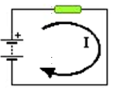
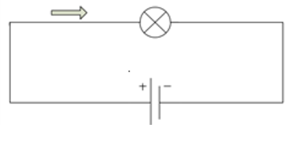
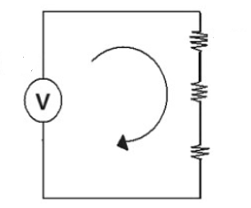

## :trophy: C1.2 Reto en clase

**Conceptos de electrónica básica y circuitos**

### :blue_book: Instrucciones
___

- De acuerdo con la información presentada por el asesor referente al tema electrónica básica, contestar las preguntas indicadas dentro del apartado desarrollo.
- Toda actividad o reto se deberá realizar utilizando el estilo **MarkDown con extension .md** y el entorno de desarrollo VSCode, debiendo ser elaborado como un documento **single page**, es decir si el documento cuenta con imágenes, enlaces o cualquier documento externo debe ser accedido desde etiquetas y enlaces.
- Es requisito que el archivo .md contenga una etiqueta del enlace al repositorio de su documento en Github, por ejemplo **Enlace a mi GitHub**
- Al concluir el reto el reto se deberá subir a github el archivo .md creado.
- Desde el archivo **.md** se debe exportar un archivo **.pdf** con la nomenclatura **C1.2_NombreAlumno_Equipo.pdf**, el cual deberá subirse a classroom dentro de su apartado correspondiente, para que sirva como evidencia de su entrega; siendo esta plataforma **oficial** aquí se recibirá la calificación de su actividad por individual.
- Considerando que el archivo .pdf, fue obtenido desde archivo .md, ambos deben ser idénticos y mostrar el mismo contenido.
- Su repositorio ademas de que debe contar con un archivo **readme**.md dentro de su directorio raíz, con la información como datos del estudiante, equipo de trabajo, materia, carrera, datos del asesor, e incluso logotipo o imágenes, debe tener un apartado de contenidos o indice, los cuales realmente son ligas o **enlaces a sus documentos .md**, _evite utilizar texto_ para indicar enlaces internos o externo.
- Se propone una estructura tal como esta indicada abajo, sin embargo puede utilizarse cualquier otra que le apoye para organizar su repositorio.

``` 
| readme.md
| | blog
| | | C0.1_x.md
| | | C0.2_x.md
| | | C0.3_x.md
| | img
| | docs
| | | A0.1_x.md
| | | A0.2_x.md
```

### :pencil2: Desarrollo
___
1. Analizar los tres siguientes circuitos y responder a lo que se pregunta en cada uno de ellos, **explicando** como se obtuvo el resultado.

+ Un circuito que tiene una pila de 6 voltios genera una corriente que atraviesa una resistencia eléctrica de 2 ohmios. Cual es el valor de la intensidad de la corriente que pasa por la resistencia?
 
    I = V / R = 6v / 2 ohms = 3 amp
   
    Elemento | Valor | 
    ---------|----------|
    R | 2 ohms | 
    V | 6 v | 
    IR | 3 amp | 



+ Hallar la tension de la pila que necesitas para que pase una corriente cuya intensidad es de 3 amperes por una bombilla que tiene 2 ohmios de resistencia.

    V = I * R = 3 amp * 2 ohms = 6v

    Elemento | Valor | 
    ---------|----------|
    V | 6 v | 
    I | 3 amp | 
    R | 2 ohms | 



+ Calcular la corriente eléctrica total y el voltaje en cada resistencia.
    
    - IT = VT / RT = 60 v / 212 ohms = 283.018 miliamp
    - VR1 = IT * R1 = 283.018 miliamp * 80 ohms = 22.6415 v
    - VR2 = IT * R2 = 283.018 miliamp * 120 ohms = 33.9622 v
    - VR3 = IT * R3 = 283.018 miliamp * 12 ohms = 3.3962 v

    Comprobacion:
    - VT = VR1 + VR2 + VR3 = 22.6415v + 33.9622v + 3.3962v = 59.9999 v ∼ 60 v


    Elemento | Valor | 
    ---------|----------|
    R1 | 80 ohms | 
    R2 | 120 ohms | 
    R3 | 12 ohms | 
    VT | 60 volts | 
    VR1 | 22.6415 V | 
    VR2 | 33.9622 V |     
    VR3 | 3.3962 V | 
    IT |  283.018 miliamp | 




___

### :bomb: Rubrica

| Criterios     | Descripción                                                                                  | Puntaje |
| ------------- | -------------------------------------------------------------------------------------------- | ------- |
| Instrucciones | Se cumple con cada uno de los puntos indicados dentro del apartado Instrucciones?            | 20 |
| Desarrollo    | Se respondió a cada uno de los puntos solicitados dentro del desarrollo de la actividad?     | 80      |

:wolf: [Mi Github](https://github.com/Alfredopflc/Sistemas-Programables) 