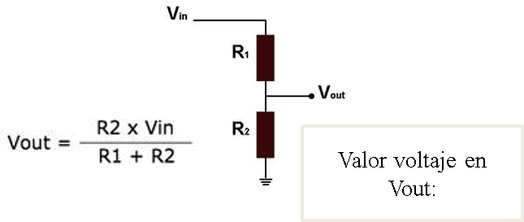

# Sensores

## :trophy: C1.3 Reto en clase

Circuito electrónico para uso con sensores y transductores

### :blue_book: Instrucciones
___

- De acuerdo con la información presentada por el asesor referente al tema sensores y transductores, contestar las preguntas indicadas dentro del apartado desarrollo.
- Toda actividad o reto se deberá realizar utilizando el estilo **MarkDown con extension .md** y el entorno de desarrollo VSCode, debiendo ser elaborado como un documento **single page**, es decir si el documento cuanta con imágenes, enlaces o cualquier documento externo debe ser accedido desde etiquetas y enlaces.
- Es requisito que el archivo .md contenga una etiqueta del enlace al repositorio de su documento en Github, por ejemplo **Enlace a mi GitHub**
- Al concluir el reto el reto se deberá subir a github el archivo .md creado.
- Desde el archivo **.md** se debe exportar un archivo **.pdf** con la nomenclatura **C1.3_NombreAlumno_Equipo.pdf**, el cual deberá subirse a classroom dentro de su apartado correspondiente, para que sirva como evidencia de su entrega; siendo esta plataforma **oficial** aquí se recibirá la calificación de su actividad por individual.
- Considerando que el archivo .pdf, fue obtenido desde archivo .md, ambos deben ser idénticos y mostrar el mismo contenido.
- Su repositorio ademas de que debe contar con un archivo **readme**.md dentro de su directorio raíz, con la información como datos del estudiante, equipo de trabajo, materia, carrera, datos del asesor, e incluso logotipo o imágenes, debe tener un apartado de contenidos o indice, los cuales realmente son ligas o **enlaces a sus documentos .md**, _evite utilizar texto_ para indicar enlaces internos o externo.
- Se propone una estructura tal como esta indicada abajo, sin embargo puede utilizarse cualquier otra que le apoye para organizar su repositorio.


```  
| readme.md
| | blog
| | | C0.1_x.md
| | | C0.2_x.md
| | | C0.3_x.md
| | img
| | docs
| | | A0.1_x.md
| | | A0.2_x.md
```

## :pencil2: Desarrollo

___

**Listado de preguntas**

1. ¿Cuál es la diferencia entre un sensor y un transductor?  
   R = Un sensor se utiliza para medir una variable física de interés. Mientras que el transductor es un dispositivo que transforma un tipo de variable física (por ejemplo, fuerza, presión, temperatura, velocidad, etc.) en otro.

2. ¿Cuáles son los elementos importantes de un sensor?  
+ Sensor
+ Transductor
+ Acondicionador de señal

3. ¿Qué nombre recibe un elemento electrónico en el cual su valor de resistencia es dependiente de la cantidad de luz al que esta expuesto?   
    R = Sensor LDR o Fotoresistor.

4. Calcular el valor de voltaje en Vout dado que R1=750 ohm, R2=100 ohm y Vin= 3.3v  
+ Vout = (R2 * Vin)/(R1 + R2) 
+ Vout = (100 ohms * 3.3v) / (750 ohms + 100 ohm)
+ Vout = (330 ohms v) / (850 ohms)
+ Vout = 0.3882 V



5. ¿Qué valor de Rango de impedancia se debería tener en R2 para que el rango de valor en Vout sea de 0 a 3.3V si Vin es de 5v y R1=750 ohms? Explique los cálculos realizados para obtener ese valor.

**Despejamos la formula:** 
+ Vout = (R2 * Vin)/(R1 + R2) 
+ Vout (R1 + R2) = (R2 * Vin)
+ (R1 * Vout) + (R2 * Vout) = Vin * R2
+ (R1 * Vout) = (Vin * R2) - (R2 * Vout)
+ R1 * Vout = R2 (Vin - Vout)
+ (R1 * Vout) / (Vin - Vout) = R2
+ R2 = (R1 * Vout) / (Vin - Vout)

**Vout = 0v**
+ R2 = (R1 * Vout) / (Vin - Vout)
+ R2 = (750 ohms * 0 v) / (5 v - 0 v)
+ R2 = 0 ohms v / 5 v
+ R2 = 0 ohms

**Vout = 2.5 v**
+ R2 = (R1 * Vout) / (Vin - Vout)
+ R2 = (750 ohms * 2.5 v) / (5 v - 2.5 v)
+ R2 = 1875 ohms v / 2.5 v
+ R2 = 750 ohms

**Vout = 3.3 v**
+ R2 = (R1 * Vout) / (Vin - Vout)
+ R2 = (750 ohms * 3.3 v) / (5 v - 3.3 v)
+ R2 = 2475 ohms v / 1.7 v
+ R2 = 1455.8823 ohms

    Vout | R2 |
    ----|----|
    0 v | 0 ohms |
    2.5 v | 750 ohms |
    3.3 v | 1455.8823 ohms |

:pencil2: **Comprobacion:**

+ Vout = (0 ohms * 5v) / (750 ohms + 0 ohms) = 0 v
+ Vout = (750 ohms * 5v) / (750 ohms + 750 ohms) = 2.5 v  
+ Vout = (1455.8823 ohms * 5v) / (750 ohms + 1455.8823 ohms) = 3.2999 v ∼ 3.3 v
___

### :bomb: Rubrica

| Criterios     | Descripción                                                                                  | Puntaje |
| ------------- | -------------------------------------------------------------------------------------------- | ------- |
| Instrucciones | Se cumple con cada uno de los puntos indicados dentro del apartado Instrucciones?            | 20 |
| Desarrollo    | Se respondió a cada uno de los puntos solicitados dentro del desarrollo de la actividad?     | 80      |

:wolf: [Mi Github](https://github.com/Alfredopflc/Sistemas-Programables) 
