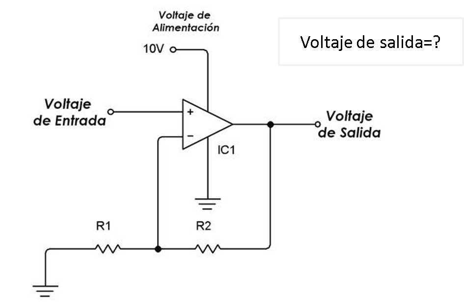

# Sensores
## :trophy: C1.4 Reto en clase

Circuito electrónico para el acondicionamiento de señal con un amplificador operacional

### :blue_book: Instrucciones

___

- De acuerdo con la información presentada por el asesor referente al tema acondicionadores de señal, contestar lo que se indica dentro del apartado desarrollo.

- Toda actividad o reto se deberá realizar utilizando el estilo **MarkDown con extension .md** y el entorno de desarrollo VSCode, debiendo ser elaborado como un documento **single page**, es decir si el documento cuanta con imágenes, enlaces o cualquier documento externo debe ser accedido desde etiquetas y enlaces.
- Es requisito que el archivo .md contenga una etiqueta del enlace al repositorio de su documento en Github, por ejemplo **Enlace a mi GitHub**
- Al concluir el reto el reto se deberá subir a github el archivo .md creado.
- Desde el archivo **.md** se debe exportar un archivo **.pdf** con la nomenclatura **C1.4_NombreAlumno_Equipo.pdf**, el cual deberá subirse a classroom dentro de su apartado correspondiente, para que sirva como evidencia de su entrega; siendo esta plataforma **oficial** aquí se recibirá la calificación de su actividad por individual.
- Considerando que el archivo .pdf, fue obtenido desde archivo .md, ambos deben ser idénticos y mostrar el mismo contenido.
- Su repositorio ademas de que debe contar con un archivo **readme**.md dentro de su directorio raíz, con la información como datos del estudiante, equipo de trabajo, materia, carrera, datos del asesor, e incluso logotipo o imágenes, debe tener un apartado de contenidos o indice, los cuales realmente son ligas o **enlaces a sus documentos .md**, _evite utilizar texto_ para indicar enlaces internos o externo.
- Se propone una estructura tal como esta indicada abajo, sin embargo puede utilizarse cualquier otra que le apoye para organizar su repositorio.

```  
| readme.md
| | blog
| | | C0.1_x.md
| | | C0.2_x.md
| | | C0.3_x.md
| | img
| | docs
| | | A0.1_x.md
| | | A0.2_x.md
```


## :pencil2: Desarrollo

___

**Problema a resolver:**

1. Calcular el valor de R1 y R2 que se requiere, para obtener una voltaje de salida de 3.3v, dado que el Voltaje de entrada es de 2.5v? Explique el procedimiento utilizado para realizar el calculo y considere valores comerciales para las resistencias que se considere utilizar. 
- Datos:
``` 
Voltaje de Entrada: 2.5 v
Voltaje de Salida: 3.3 v
R1 = ?
R2 = ?
``` 
- Despeje de formula:
``` 
  Vsalida = Ventrada(1 + R2/R1)
  Vsalida/Ventrada = 1 + R2/R1
  Vsalida/Ventrada - 1 = R2/R1
  R2/R1 = Vsalida/Ventrada - 1
``` 
- Calculos:
```
R2/R1 = 3.3v/2.5v - 1
R2/R1 = 0.32
```
- Podemos representar 0.32 como fraccion siendo asi 8/25 
- No obstante, 8 y 25 no son valores comerciales de resistencias, por lo tanto se decidio por buscar una combinacion de resistencias de modo que su division diera 0.32
- Entre las opciones buscadas estaban:
```
• 150 ohms / 470 ohms = 0.3191 ohms
• 180 ohms / 560 ohms = 0.3214 ohms
• 220 ohms / 680 ohms = 0.3235 ohms
• 39 ohms / 120 ohms = 0.325 ohms
• 47 ohms / 150 ohms = 0.3133 ohms
```
- A pesar de que daban valores muy cercanos, no fueron exactamente los 0.32 por lo tanto se decidio que R2 estuviera compuesta por 2 resistencias en serie.
- De modo que:
```
R1 = 3.3 k ohms = 3300 ohms
R2 = 1 k ohms + 56 ohms = 1056 ohms
```
- Comprobación:
```
Vsalida = Ventrada(1 + R2/R1)
Vsalida = 2.5 v (1 + 1056 ohms / 3300 ohms )
Vsalida = 2.5 v (1.32 )
Vsalida = 3.3 v
```
- Resistencias comerciales:  
[56 ohms](https://www.steren.com.mx/resistencia-de-carbon-de-1-2-watt-al-5-de-tolerancia-de-56-ohms.html)  
[1 k ohms](https://www.steren.com.mx/resistencia-de-carbon-de-1-watt-al-5-de-tolerancia-de-1-kohm.html)  
[3.3 k ohms](https://www.steren.com.mx/resistencia-de-carbon-de-1-2-watt-al-5-de-tolerancia-de-3-3-kohms.html)




___

### :bomb: Rubrica

| Criterios     | Descripción                                                                                  | Puntaje |
| ------------- | -------------------------------------------------------------------------------------------- | ------- |
| Instrucciones | Se cumple con cada uno de los puntos indicados dentro del apartado Instrucciones?            | 20 |
| Desarrollo    | Se respondió a cada uno de los puntos solicitados dentro del desarrollo de la actividad?     | 80      |

___

:wolf: [Mi Github](https://github.com/Alfredopflc/Sistemas-Programables)