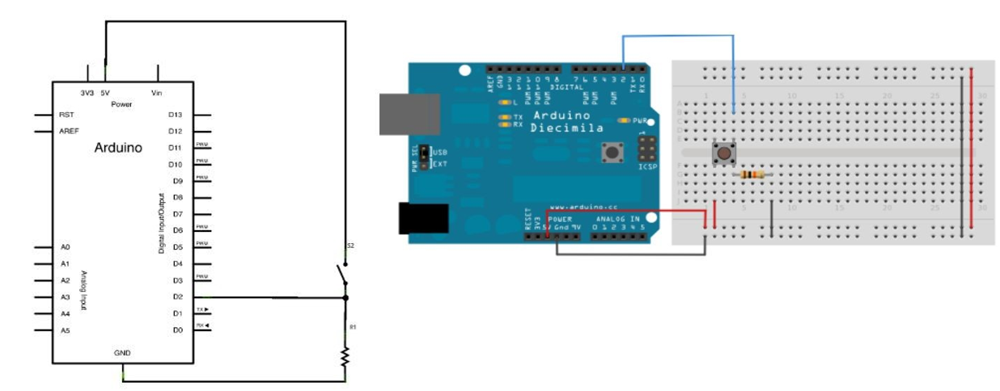
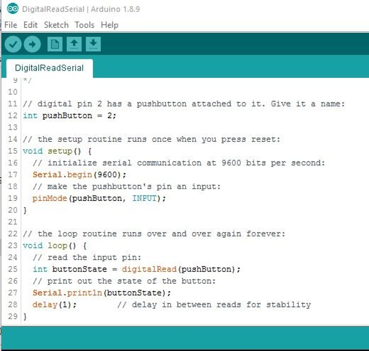
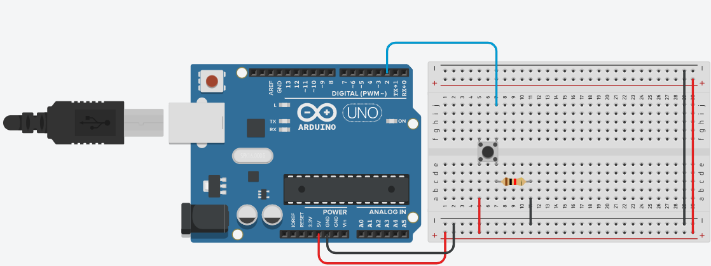
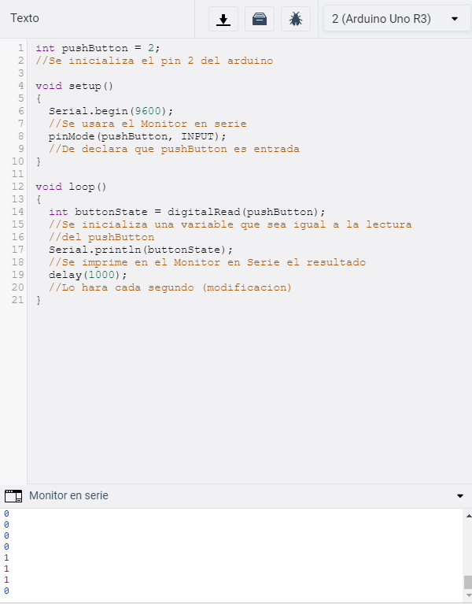

# Programación Microcontrolador Arduino

## :trophy: C3.2 Entradas digital

Arduino y entrada digital, utilizando un push button y una resistencia.

## :blue_book: Instrucciones

- De acuerdo con la información presentada por el asesor referente al tema, desarrollar lo que se indica dentro del apartado siguiente.
- Toda actividad o reto se deberá realizar utilizando el estilo **MarkDown con extension .md** y el entorno de desarrollo VSCode, debiendo ser elaborado como un documento **single page**, es decir si el documento cuanta con imágenes, enlaces o cualquier documento externo debe ser accedido desde etiquetas y enlaces.
- Es requisito que el archivo .md contenga una etiqueta del enlace al repositorio de su documento en Github, por ejemplo **Enlace a mi GitHub**
- Al concluir el reto el reto se deberá subir a github el archivo .md creado.
- Desde el archivo **.md** se debe exportar un archivo **.pdf** con la nomenclatura **C3.2_NombreAlumno_Equipo.pdf**, el cual deberá subirse a classroom dentro de su apartado correspondiente, para que sirva como evidencia de su entrega; siendo esta plataforma **oficial** aquí se recibirá la calificación de su actividad por individual.
- Considerando que el archivo .pdf, fue obtenido desde archivo .md, ambos deben ser idénticos y mostrar el mismo contenido.
- Su repositorio ademas de que debe contar con un archivo **readme**.md dentro de su directorio raíz, con la información como datos del estudiante, equipo de trabajo, materia, carrera, datos del asesor, e incluso logotipo o imágenes, debe tener un apartado de contenidos o indice, los cuales realmente son ligas o **enlaces a sus documentos .md**, _evite utilizar texto_ para indicar enlaces internos o externo.
- Se propone una estructura tal como esta indicada abajo, sin embargo puede utilizarse cualquier otra que le apoye para organizar su repositorio.  

``` 
| readme.md
| | blog
| | | C3.1_TituloActividad.md
| | | C3.2_TituloActividad.md
| | | C3.3_TituloActividad.md
| | img
| | docs
| | | A3.1_TituloActividad.md
| | | A3.2_TituloActividad.md
```


## :pencil2: Desarrollo

1. Basado en el siguiente circuito, y utilizando uno de los simuladores propuestos, ensamblar lo que observa.

<p align="center">
    
</p>

2. Analice y escriba el programa que se muestra a continuación.

<p align="center">
    
</p>

3. Inserte imágenes que considere como evidencias para demostrar el resultado obtenido.  
**R=** Se realizo un programa que mostrara los valores de 0 y 1 dependiendo de la pulsacion del boton. Se declaro un pin como entrada, al presionar el boton la corriente pasara y el Arduino mostrara 1, si no se presiona, entonces Arduino mostrara 0. Para una mejor visualizacion, se decidio que el Arduino lo hiciera cada 1 segundo (1000 milisegundos) para una mejor visualizacion.

  


### :bomb: Rubrica

| Criterios     | Descripción                                                                                  | Puntaje |
| ------------- | -------------------------------------------------------------------------------------------- | ------- |
| Instrucciones | Se cumple con cada uno de los puntos indicados dentro del apartado Instrucciones?            | 20 |
| Desarrollo    | Se respondió a cada uno de los puntos solicitados dentro del desarrollo de la actividad?     | 80      |

:house: [Ir a microcontroladores](../docs/D3.0_Microcontroladores.md)