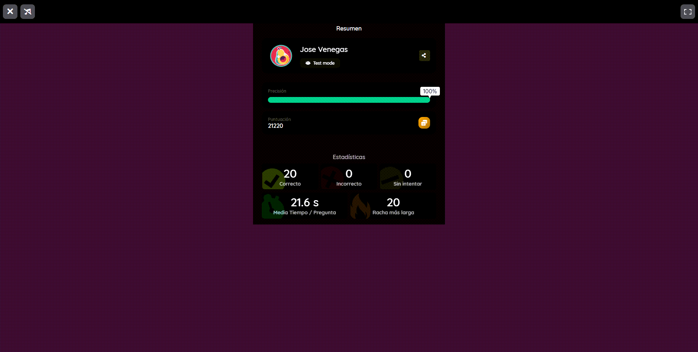
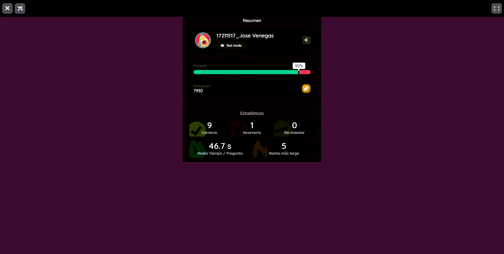

# :trophy: A.1.1 Actividad de aprendizaje

## Objetivo

Realizar una evaluación de fundamentos de electrónica sobre los temas observados durante clases.

## :blue_book: Instrucciones

+ El alumno bajara la aplicación que el asesor le haga saber a su dispositivo móvil antes de iniciar el examen de evaluación de conocimientos básicos de electrónica, e incluso puede acceder desde un ordenador.
+ El alumno será evaluado individualmente, por lo que deberá subir en classroom dentro del apartado de la actividad una imagen de los resultados de su evaluación la cual servirá como evidencia de haber concluido la actividad.
+ El alumno al finalizar la actividad deberá renombrar la imagen antes de subirla a classroom, utilizando la nomenclatura **A1.1_NombreApellido_Equipo**

## :pencil2: Desarrollo

1. Ingrese con el numero de enlace que el asesor proporcionara por medio de la plataforma [quizzi](https://quizizz.com/), por la cual debió haber sido instalada con anticipacion si es que utilizara un dispositivo movil.
2. Para el caso de que se utilice un ordenador debe acceder a través de un browser al enlace proporcionado.
3. Registrese a la plataforma utilizando la nomenclatura **NumeroDeControl_NombreApellido**
4. Una vez dentro de la plataforma espere las instrucciones del asesor.
5. Cada pregunta tiene un tiempo y cada una de ellas cuenta con múltiples opciones.

**Resultados:**  
  
    
    
  

:wolf: [Mi Github](https://github.com/Alfredopflc/Sistemas-Programables) 