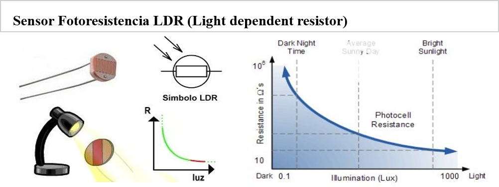

# Introducción

## :trophy: A.1.2 Actividad de aprendizaje

## Objetivo

Realizar un sensor medidor de luz (lux) a través de un circuito electrónico, utilizando un simulador, y  un **LDR (Light dependent Resistor)**.

### :blue_book: Instrucciones

- Se sugiere para el desarrollado de la presenta actividad, utilice uno de los siguientes simuladores: [Autodesk Tinkercad](https://www.tinkercad.com/), [Virtual BreadBoard](http://www.virtualbreadboard.com/), [Easy EDA](https://easyeda.com/) por lo cual habrá que familiarizarse antes, e incluso instalarse o registrarse dentro de la plataforma.
- Toda actividad o reto se deberá realizar, utilizando el estilo **MarkDown con extension .md** y el entorno de desarrollo VSCode, debiendo ser elaborado como un documento **single page**, es decir si el documento cuanta con imágenes, enlaces o cualquier documento externo debe ser accedido desde etiquetas y enlaces, y debe ser nombrado con la nomenclatura **A1.2_NombreApellido_Equipo.pdf.**
- Es requisito que el .MD contenga una etiqueta del enlace al repositorio de su documento en GITHUB, por ejemplo **Enlace a mi GitHub** y al concluir el reto se deberá subir a github.
- Desde el archivo **.md** exporte un archivo **.pdf** que deberá subirse a classroom dentro de su apartado correspondiente, sirviendo como evidencia de su entrega, ya que siendo la plataforma **oficial** aquí se recibirá la calificación de su actividad.
- Considerando que el archivo .PDF, el cual fue obtenido desde archivo .MD, ambos deben ser idénticos.
- Su repositorio ademas de que debe contar con un archivo **readme**.md dentro de su directorio raíz, con la información como datos del estudiante, equipo de trabajo, materia, carrera, datos del asesor, e incluso logotipo o imágenes, debe tener un apartado de contenidos o indice, los cuales realmente son ligas o **enlaces a sus documentos .md**, _evite utilizar texto_ para indicar enlaces internos o externo.
- Se propone una estructura tal como esta indicada abajo, sin embargo puede utilizarse cualquier otra que le apoye para organizar su repositorio.
  
```
- readme.md
  - blog
    - C0.1_x.md
    - C0.2_x.md
  - img
  - docs
    - A0.1_x.md
    - A0.2_x.md
    - A1.2_x.md
    - A1.3_x.md
```


### :pencil2: Desarrollo

1. Utilice el siguiente listado de materiales para la elaboración de la actividad y agregue en la columna Fuente de consulta su enlace _bibliográfico_.

    | Cantidad | Descripción                      | Fuente de consulta |
    | -------- | -------------------------------- | ------------------ |
    | 1        | Sensor Fotoresistencia LDR de 2M | [como-funciona.com](https://como-funciona.co/una-fotorresistencia/)                 |
    | 1        | Resistencia 1k                   | [electrocomponentes.es](https://www.electrocomponentes.es/resistencias/resistencia-1k-ohm-025w-39-.html#:~:text=Peque%C3%B1a%20resistencia%20de%20pel%C3%ADcula%20de,de%20trabajo%20de%20hasta%20300v)                   |
    | 1        | Fuente de alimentación de 5v.    | [handsontec.com](http://www.handsontec.com/dataspecs/mb102-ps.pdf)                   |  
  


2. Considerando que el elemento LDR es un sensor fotoresistivo es decir varia su resistencia en base a la cantidad de luz que incide sobre el, **Que observa en el grafico siguiente?**  
**R=** Cuando la fotorresistencia se encuentra en ausencia de luz el valor de su resistencia será el "máximo" y conforme aumentan los niveles de luz el valor de su resistencia va disminuyendo. 
   
<p align="center">
    
</p>  

3. Ensamble el circuito que se muestra utilizado el simulador que halla considerado, colocando la fotorresistencia en la posición LDR y resistencia de acuerdo con la imagen del esquemático:

    <p align="center"> 
        
    </p>
4. Coloque la imagen finalmente obtenida del circuito ensamblado dentro de su simulador.

<p align="center"> 
        
    </p>

5. Mida la **resistencia** de la fotorresistencia con el ohmetro bajo las siguientes condiciones: ausencia de luz u oscuridad,  luz ambiente, luz intensiva y registre en la tabla correspondiente.


6. Calcule el **valor de voltaje Vout teórico** para cada una de las condiciones antes indicadas asi como el valor de voltaje Vout medido  y registre en la tabla correspondiente.  
  
**Vout Oscuridad:**
+ Vout = (R2 * Vin)/(R1 + R2)
+ Vout = (1000 ohms * 5v) / (180000 ohms + 1000 ohms)
+ Vout = (5000 ohms v) / (181000 ohms)
+ Vout = 0.0276 v ∼ 27.6 mv

**Vout Luz Ambiente:**
+ Vout = (R2 * Vin)/(R1 + R2)
+ Vout = (1000 ohms * 5v) / (912 ohms + 1000 ohms)
+ Vout = (5000 ohms v) / (1912 ohms)
+ Vout = 2.615v

**Vout Luz Intensiva:**
+ Vout = (R2 * Vin)/(R1 + R2)
+ Vout = (1000 ohms * 5v) / (506 ohms + 1000 ohms)
+ Vout = (5000 ohms v) / (1506 ohms)
+ Vout = 3.32005v  
  

7. Calcule el **valor de exactitud** de voltaje entre lo teórico y lo medido para cada condición  y registre en la tabla correspondiente.

    | Condicion          |  Impedancia en fotoresistencia | Voltaje Vout teórico | Voltaje Vout medido | %  V.Medido/ V.Teórico | 
    | --------------- | ----------------------------- | -------------------- | ------------------- | ---------------------- | 
    | Ausencia de luz | 180 k ohms  | 27.6 mv   | 27.7 mv   | 100.36 %  | 
    | Luz ambiental   | 912 ohms    | 2.615 v   | 2.61 v    | 99.80 %   | 
    | Luz intensa     | 506 ohms    | 3.32005 v | 3.32 v    | 100.001 % |
  
    <p align="center"> 
        
    </p>


8. **Grafique** a través de los valores registrados en la tabla anterior de tal manera que se pueda observar el comportamiento de la curva del componente LDR e **inserte la grafica**.

  <p align="center"> 
        
    </p> 


9.  Inserte imágenes de **evidencias** tales como son reuniones  de los integrantes del equipo realizadas para el desarrollo de la actividad.  
  
  


10. Incluya las conclusiones individuales y resultados observados durante el desarrollo de la actividad.  

**Acevedo Ensiso Pedro Gabriel:**  
Como podemos ver el circuito divisor de voltaje armado funciona de manera correcta, al estar en total oscuridad el valor de la resistencia del fotoresistor será el máximo por lo tanto este tendrá mayor oposición al voltaje reduciéndolo a tan solo 27.7mV pero al comenzar a irradiar luz sobre el sensor la resistencia comienza a reducir dejando pasar mas voltaje con un máximo medido de 3.32V.   
  
**Ramirez Cervantes Cesar Manuel:**  
En esta actividad lo más sencillo de entender para mí fue el funcionamiento del fotorresistor el cual entre más intensa sea la luz que percibe la impedancia disminuye y en caso contrario cuando la intensidad de luz que percibe disminuye la impedancia de este componente aumenta, por consecuente entre mayor sea la impedancia el voltaje que sale de la fotorresistencia es menor y entre menor sea la impedancia el voltaje que sale de la fotorresistencia es mayor.
En cuanto a los cálculos es bastante comprensible el procedimiento para resolverlos, lo que a mí se me dificulta es la medición con el milímetro para obtener los valores del circuito pero gracias a las reuniones como equipo logre aprender mejor su uso, así como el ensamble del circuito. De todos los integrantes yo soy el que tiene menos conocimientos en el tema de electrónica así que soy el que tiene un poco mas de trabajo que hacer.

**Venegas Medina Jose Alfredo:**  
Como pudimos comprobar en la actividad un divisor de voltaje es un circuito que reparte la tensión de una fuente entre una o más impedancias conectadas. Pudimos observar que con dos resistencias en serie y un voltaje de entrada, es posible obtener un voltaje de salida equivalente a una fracción de dicha entrada. Por otro lado, comprobamos que con la fotoresistencia varía su valor en función de la cantidad de luz teniendo asi que con mayor luz su resistencia disminuye y por lo tanto el voltaje sube.   
  
**Villalobos Perez Dulce Jasmin:**   
Cuando realizamos la simulación del circuito note que como ya lo habíamos comentado cuando la ausencia de luz está presente en este caso lo simulamos a 180 KOhms obtuvimos como resultado una disminución de voltaje, ya que la resistencia es mayor en estas condiciones, mientras que a luz ambiente en 912 Ohms obtuvimos un resultado de 2.61 volt y los datos fueron muy similar a los calculados, para la tercera condición la luz intensa la residencia fue de 506 ohms y el resultado medido y el calculado fue el mismo, y notamos qué en esta condición hay una menor resistencia por lo cual permite qué más flujo de voltaje circule.  


### :bomb: Rubrica

| Criterios     | Descripción                                                                                  | Puntaje |
| ------------- | -------------------------------------------------------------------------------------------- | ------- |
| Instrucciones | Se cumple con cada uno de los puntos indicados dentro del apartado Instrucciones?            | 10      |  | 5 |
| Desarrollo    | Se respondió a cada uno de los puntos solicitados dentro del desarrollo de la actividad?     | 60      |
| Demostración  | El alumno se presenta durante la explicación de la funcionalidad de la actividad?            | 20      |
| Conclusiones  | Se incluye una opinión personal de la actividad  por cada uno de los integrantes del equipo? | 10      |

**EQUIPO VERDE**  
**Acevedo Ensiso Pedro Gabriel:**   
:house: [Ir a mi Github](https://github.com/Gabriel123x/Sistemas_Programables.git)

**Ramirez Cervantes Cesar Manuel:**  
## :link: [Enlace a mi repositorio](https://github.com/CMRamirezC/Sistemas_Programables_Ramirez_Cervantes.git) :link:


**Venegas Medina Jose Alfredo:**   
:wolf: [Mi Github](https://github.com/Alfredopflc/Sistemas-Programables)

**Villalobos Perez Dulce Jasmin:**  
:house: :open_file_folder: [ENLACE - MI GITHUB](https://github.com/Villalobos39/SISTEMAS-PROGRAMABLES.git )


