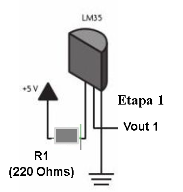

# Sensores

## :trophy: A.1.4 Actividad de aprendizaje

## Objetivo

Realizar un sensor medidor de temperatura a través de un circuito electrónico, utilizando un simulador, y  un **Transistor TMP36** lineal de temperatura y un **amplificador operacional LM741**.

## :blue_book: Instrucciones

- Se sugiere para el desarrollado de la presenta actividad, utilice uno de los siguientes simuladores: [Autodesk Tinkercad](https://www.tinkercad.com/), [Virtual BreadBoard](http://www.virtualbreadboard.com/), [Easy EDA](https://easyeda.com/) por lo cual habrá que familiarizarse antes, e incluso instalarse o registrarse dentro de la plataforma.
- Toda actividad o reto se deberá realizar utilizando el estilo **MarkDown con extension .md** y el entorno de desarrollo VSCode, debiendo ser elaborado como un documento **single page**, es decir si el documento cuanta con imágenes, enlaces o cualquier documento externo debe ser accedido desde etiquetas y enlaces, y debe ser nombrado con la nomenclatura **A1.4_NombreApellido_Equipo.pdf.**
- Es requisito que el .md contenga una etiqueta del enlace al repositorio de su documento en GITHUB, por ejemplo **Enlace a mi GitHub** y al concluir el reto se deberá subir a github.
- Desde el archivo **.md** exporte un archivo **.pdf** que deberá subirse a classroom dentro de su apartado correspondiente, sirviendo como evidencia de su entrega, ya que siendo la plataforma **oficial** aquí se recibirá la calificación de su actividad.
- Considerando que el archivo .PDF, el cual fue obtenido desde archivo .MD, ambos deben ser idénticos.
- Su repositorio ademas de que debe contar con un archivo **readme**.md dentro de su directorio raíz, con la información como datos del estudiante, equipo de trabajo, materia, carrera, datos del asesor, e incluso logotipo o imágenes, debe tener un apartado de contenidos o indice, los cuales realmente son ligas o **enlaces a sus documentos .md**, _evite utilizar texto_ para indicar enlaces internos o externo.
- Se propone una estructura tal como esta indicada abajo, sin embargo puede utilizarse cualquier otra que le apoye para organizar su repositorio.
  
```
- readme.md
  - blog
    - C0.1_x.md
    - C0.2_x.md
  - img
  - docs
    - A0.1_x.md
    - A0.2_x.md
    - A1.2_x.md
    - A1.3_x.md
```

## :pencil2: Desarrollo

1. Utilice el siguiente listado de materiales para la elaboración de la actividad

    | Cantidad | Descripción                       | Fuente de consulta |
    | -------- | --------------------------------- | ------------------ |
    | 1        | Sensor temperatura TMP36          | [Geekboot](http://www.geekbotelectronics.com/producto/tmp36-sensor-de-temperatura/)                   |
    | 1        | Potenciómetro 10k                 | [Microjpm](https://www.microjpm.com/products/potenciometro-lineal-rotativo-10ko/)                   |
    | 2        | Resistencias de 220               | [Geekbot](http://www.geekbotelectronics.com/producto/resistencia-220-ohm-14-w/)                   |
    | 1        | Amplificador LM741                | [Texas Instruments](https://www.ti.com/lit/ds/symlink/lm741.pdf)                   |
    | 1        | Fuente de alimentación de 5Volts. | [Handson Technology](http://www.handsontec.com/dataspecs/mb102-ps.pdf)                   |

    Para mayor información acceder a los siguientes enlaces:

    - Información y especificaciones del [Sensor TMP36](https://components101.com/sites/default/files/component_pin/TMP36-Sensor-Pinout.png)  
    - Información y especificaciones del [Amplificador operacional LM741](https://ortegamraul.files.wordpress.com/2014/03/741-interno.png)

2. Basado en la imagen ensamble mediante un simulador el circuito electrónico etapa 1, colocando el transistor LM35 en la posición indicada. 

<p align="center">
    
</p>  


3. Calcule, mida y registre los valores solicitados para Vout1, bajos las 3 condiciones requeridas en la tabla anexa.

| Numero | Condición | Voltaje Vout1 medido | Voltaje en R1 medido | Temperatura indicada |
| ------ | --------- | -------------------- | -------------------- | -------------------- |
| 1   | Mínima  | 99.9 mV   | 11 mV   | -40 °C    |
| 2   | Media   | 909 mV    | 11 mV   | 40 °C     |
| 3   | Máxima  | 1.75 V    | 11 mV   | 125 °C    |

___
FORMULA: Temperatura = (Vout - 0.5) * 100
```
Minima:
Temperatura = (.0999V - 0.5) * 100
Temperatura = -40.01 °C

Media:
Temperatura = (.909V - 0.5) * 100
Temperatura = 40.9 °C

Maxima: 
Temperatura = (1.75V - 0.5) * 100
Temperatura = 125 °C
```


4. Utilizando la imagen del transistor TMP36 que corresponde a la etapa 1, conecte la terminal Vout1 a la terminal no inversora del LM741, y ensamble el circuito correspondiente a la etapa 2.

<p align="center">
    

</p>


5. **Que valor deberá tener R3 en el circuito Etapa 2, para lograr obtener Vout2 = 5 volts,** para la condición máxima de temperatura que el sensor es capaz de detectar? Como se puede observar la resistencia R3 corresponde a un potenciómetro, sin embargo se pueden hacer arreglos de resistencias para lograr un ajuste fino.  Cual cree que sea la razón por la cual se esta solicitando un **ajuste a 5 Volts**?
**Teorico:** 
```
DESPEJE:
  Vsalida = Ventrada(1 + R2/R1)
  Vsalida/Ventrada = 1 + R2/R1
  Vsalida/Ventrada - 1 = R2/R1
  R2/R1 = (Vsalida/Ventrada) - 1
  R2 = [(Vsalida/Ventrada) - 1] * R1

CALCULOS:
  R2 = [(Vsalida/Ventrada) - 1] * R1
  R2 = [(5 V/ 1.75 V) - 1] * 220 ohms
  R2 = 408.57
```
Es necesario que R3 = 408.57 ohms (comercialmente serian una resistencia de 220 ohms y una de 180 ohms en serie para lograr un aproximado) para lograr obtener Vout2 = 5 V para la condición máxima de temperatura (125 °C), esto hablando teoricamente.

**Simulado:**  
Es necesario que R3 = 600 ohms para lograr obtener Vout2 = 5 V para la condición máxima de temperatura (125°C), pero ya que no existe una resistencia comercial de 600 ohms, colocamos 2 resistencias en serie (una de 270 ohms y otra de 330 ohms). La razón por la cual se solicita un ajuste de 5 Volts es porque es el voltaje de operación por defecto en muchos componentes digitales utilizados para el control.
   
6. Una vez que se ha ajustado el valor R3 dejalo asi y registre los valores solicitados para Vout2, para las 3 condiciones requeridas en la tabla anexa.

| Numero | Condición        | Voltaje en R2 medido | Voltaje en Vout2 medido | Temperatura indicada |
| ------ | ---------------- | -------------------- | ----------------------- | -------------------- |
| 1  | Condición mínima | 1.23 V  | 3.38 V  | -40 °C  |
| 2  | Condición media  | 1.23 V  | 4.16 V  | 40 °C   |
| 3  | Condición máxima | 1.23 V  | 5 V     | 125 °C  |
___  

  

7. Grafique Vout1 y Vout2, para las tres condiciones anteriores, considerando en "X" los valores de temperatura y para "Y" los valores de voltaje, y coloque dentro de este apartado.


___

8. Evidencias


9.  Conclusiones  

**Acevedo Ensiso Pedro Gabriel:**  
Como podemos ver mediante un sensor de temperatura podemos controlar diversos sistemas tales como alarmas o indicadores de temperatura utilizando el voltaje de salida que tenemos en Vout1, en este caso la salida Vout1 fue dirigida a un amplificador operacional con el cual aumentamos la cantidad de voltaje obtenida a 5V durante situaciones donde la temperatura sea máxima,  el objetivo de esto probablemente es algún tipo de alarma o sistema de aviso donde una vez que tengamos 125 grados centígrados los 5V de salida en Vout 2 pueden ser utilizados para otros  sistemas de control digitales que accionen los mecanismos necesarios para cumplir el objetivo que sea necesario. Este circuito por ejemplo, fácilmente puede ser usado en aplicaciones como alarmas,  medidores de temperatura, sistemas de enfriamiento, sistemas de riego anti-incendios, etc. 
  
**Ramirez Cervantes Cesar Manuel:**  
En esta práctica se realizo un circuito para la medición de temperatura con el sensor transistor TMP36 el cual mide la temperatura ambiente en grados centígrados con precisión y bajo voltaje, así mismo se utilizo un amplificador LM741 para aumentar la señal de voltaje que proporciona el transistor a un máximo de 5 volts. Por lo que en esta práctica se observo que al disminuir la temperatura  a -40 grados el voltaje de salida en el transistor también disminuía en caso contrario al aumentar la temperatura a 125 grados también el voltaje de salida aumentaba, pero con ayuda del amplificador ese voltaje de salida es posible aumentarlo.

**Venegas Medina Jose Alfredo:**  
Demostramos por medio de esta actividad que el sensor de temperatura puede ser un elemento realmente util para distintos circuitos, como lo podria ser sistemas de control ambiental, proteccion termica a los dispositivos, alarma contra incendios, gestion termica del CPU, entre otros. Por otro lado, el amplificador operacional nos ayudara a aumentar la amplitud de una señal sin afectar otras variables, en este caso, hicimos que la salida del amplificador fuera de 5 Volts esto podria aplicarse a distintos circuitos, por ejemplo, si el circuito alimenta a un componente que necesite al menos 5 Volts para funcionar, seria bastante util considerando que la mayoria de componentes electronicos necesitan con dicha cantidad de Volts. 
  
**Villalobos Perez Dulce Jasmin:**   
Cuando realizamos la actividad donde utilizamos un sensor de temperatura, primero comenzamos con la simulación del circuito sencillo donde medimos el voltaje qué salía al cambiar los grados qué se suministran en el sensor, vimos qué al aumentar la temperatura la salida de voltaje también aumenta, eso quedo más claro cuando tuvimos qué obtener 5 v de salida, para eso usamos un amplificador y podríamos usar un potenciómetro o hacer un arreglo de resistencias en series qué al sumar fueran las necesarias para obtener una salida exacta de 5 v, notamos qué al poner 600 ohms nos daba de igual forma usando 270 y 330, de esta forma al poner el sensor térmico a 120 grados obtuvimos el resultado esperado.

### :bomb: Rubrica

| Criterios     | Descripción                                                                                  | Puntaje |
| ------------- | -------------------------------------------------------------------------------------------- | ------- |
| Instrucciones | Se cumple con cada uno de los puntos indicados dentro del apartado Instrucciones?            | 10      |
| Desarrollo    | Se respondió a cada uno de los puntos solicitados dentro del desarrollo de la actividad?     | 60      |
| Demostración  | El alumno se presenta durante la explicación de la funcionalidad de la actividad?            | 20      |
| Conclusiones  | Se incluye una opinión personal de la actividad  por cada uno de los integrantes del equipo? | 10      |

___
**EQUIPO VERDE**  
**Acevedo Ensiso Pedro Gabriel:**   
:house: [Ir a mi Github](https://github.com/Gabriel123x/Sistemas_Programables.git)

**Ramirez Cervantes Cesar Manuel:**  
## :link: [Enlace a mi repositorio](https://github.com/CMRamirezC/Sistemas_Programables_Ramirez_Cervantes.git) :link:


**Venegas Medina Jose Alfredo:**   
:wolf: [Mi Github](https://github.com/Alfredopflc/Sistemas-Programables)

**Villalobos Perez Dulce Jasmin:**  
:house: :open_file_folder: [ENLACE - MI GITHUB](https://github.com/Villalobos39/SISTEMAS-PROGRAMABLES.git )