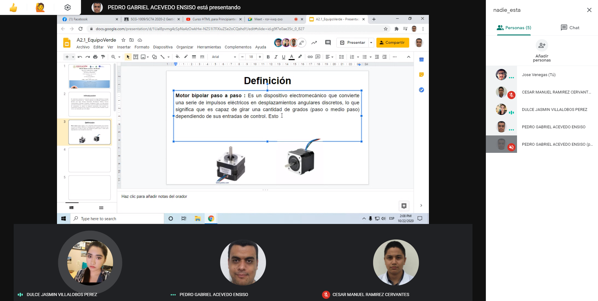

# Actuadores

## :trophy: A.2.1 Actividad de aprendizaje

**Tipos de actuadores eléctricos comerciales**

### :blue_book: Instrucciones

1. Cada equipo deberá elaborar su presentación de acuerdo con el modelo del actuador eléctrico que el asesor le indique.
2. Los temas deberán exponerse en clase por todos los integrantes evitando que se perciba la lectura del documento.
3. El tiempo máximo de la presentación deberá ser no mayor a 8 minutos.
4. La actividad será redactada utilizando el estilo ***markdown***.
5. El documento deberá incluir, los elementos indicados en la **rubrica** tales como son portada, introducción, desarrollo, conclusiones e información bibliográfica o enlaces utilizados.
6. El desarrollo deberá incluir características físicas y eléctricas, esquemático, usos aplicativos,  imágenes del actuador, asi como cualquier otra información que considere importante y que le pueda apoyar en el desarrollo de la exposición.
7. El documento deberá contar con la nomenclatura **A2.1_NombreApellido_Equipo**, y se deberá subir a la plataforma classroom en formato PDF dentro del apartado correspondiente a la actividad.
8. El documento elaborado para desarrollar la actividad será compartido en la plataforma colaborativa **GitHub**, dando acceso al asesor para su revisión.

### :pencil2: Desarrollo

1. Utilice el siguiente listado de modelos de actuadores electricos comerciales, para elaborar su actividad de acuerdo con las instrucciones solicitadas por el asesor.

   - [ ] [Motor reductor de doble eje](https://articulo.mercadolibre.com.mx/MLM-651722486-motor-reductor-de-doble-eje-recto-3-vcc-mot-120-_JM?quantity=1#position=3&type=item&tracking_id=36396cb4-7b75-41a3-97e3-a0c6af6709c3) 
   - [ ] [Motor Unipolar paso a paso](https://articulo.mercadolibre.com.mx/MLM-587352935-motor-a-pasos-pm55l-048-unipolar-75-por-paso-con-cables-_JM?quantity=1#position=3&type=item&tracking_id=1a7ba1b9-b483-4d15-889f-2b970c4779c2) 
   - [X] [Motor Bipolar paso a paso](https://articulo.mercadolibre.com.mx/MLM-783827003-motores-a-pasos-nema-23-bipolar-13kg-minebea-japones-arduino-_JM?quantity=1#position=2&type=item&tracking_id=f05c36d1-e3e0-4d19-b76e-8bbd132124fd) 
   - [ ] [Servomotor modelo SG90](https://articulo.mercadolibre.com.mx/MLM-618694358-micro-servomotor-sg90-robotica-arduino-16-kg-servo-motor-_JM?quantity=1&variation=23651072471#position=1&type=item&tracking_id=4b156b79-3721-4fc1-9ef0-4f378d92e1ef)

2. Espere a que el asesor le indique que tipo de sensor sera el que desarrollara su equipo y una vez que tenga marque el sensor dentro del punto anterior.
3. Una vez que conoce el tema a desarrollar, investigue y redacte dentro de este documento los puntos siguiente:

[**PRESENTACION**](../docs/A2.1_JoseAlfredoVenegasMedina_Verde.md)   

4. Inserte imágenes de **evidencias** tales como son reuniones  de los integrantes del equipo realizadas para el desarrollo de la actividad

  
  
  

5. Incluya las conclusiones individuales y resultados observados durante el desarrollo de la actividad.

Pedro Gabriel Acevedo Ensiso:  
Los motores paso a paso permiten controlar diversos sistemas de automatización ya que podemos controlar su posición de una manera más exacta que otros motores, en el caso de los motores bipolares contamos con dos bobinas controladas por cuatro entradas que al ser alimentadas por el voltaje de operación indicado podemos hacerla girar en el sentido deseado, la principal desventaja que se encuentra es simplemente la necesidad de usar puentes H para controlarlos estos pueden ser poco intuitivos para muchos operadores y pueden ocasionar errores de sincronización. Pero si uno aprende a usarlos para sus necesidades los motores paso a paso bipolares son actuadores excelentes.   

Cesar Manuel Ramirez Cervantes:  
En esta investigación se aprendió que un motor bipolar de paso a paso toma pequeños pulsos eléctricos los cuales convierte en movimientos discretos y gracias a esto puede girar en un número determinado de grados. Por ello los motores de paso a paso son útiles para realizar movimientos precisos, ya que por cada pulso que este recibe puede girar en un ángulo determinado. Este motor tiene 4 cables y es que la mitad de las bobinas están conectadas de manera estratégica a dos de los cables y la otra mitad a los otros 2 cables. La mayoría de los motores paso a paso se pueden accionar a frecuencias de audio, de modo que giran muy rápido. Con los controladores adecuados, se pueden iniciar y detener instantáneamente en ubicaciones controladas en determinados grados.  

Venegas Medina Jose Alfredo:  
Como se vio en la presentación, los motores bipolares paso a paso son ideales para la construcción de mecanismos en donde se requieren movimientos precisos, ya que requieren de dos fuentes de poder o una fuente de poder de polaridad conmutable. Así estos motores pueden  moverse un paso a la vez por cada pulso que se le aplique. Por lo tanto, son muy útiles ya que tienen mayor exactitud en posición y repetición. Por otro lado, su velocidad de rotación responde a la frecuencia de pulsos de entrada digitales, lo cual hace que sea perfecto para dichos circuitos. Este tipo de control elimina la necesidad de costosos dispositivos de detección y regeneración como codificadores.  

Villalobos Perez Dulce Jasmin:  
Como sabemos los motores bipolares de paso a paso son muy conocidos por ser muy precisos, esto se debe a que son alimentados por secuencia por 4 cables estos motores reciben corriente de ambos sentidos y esto permite que no solo giren pasos completos sino también dar medios, esta dirección de giro también depende la dirección del flujo de la corriente, mientras investigamos nos dimos cuenta que en el mercado hay motores más pequeños que por lo regular son buenos para el uso de prácticas, algunas de las ventajas de usar este tipo de motor es que aparte de ser más baratos, tienen mayor torque, los torques son muy importantes a tomar en cuenta, ya que están los de rotación, anclaje, arranque y de giro, también tiene un control más complicado que incluye las etapas de control de giro y potencia, esto los hace ser una buena opción de uso. 

### :bomb: Rubrica

| Criterios     | Descripción                                                                                  | Puntaje |
| ------------- | -------------------------------------------------------------------------------------------- | ------- |
| Instrucciones | Se cumple con cada uno de los puntos indicados dentro del apartado Instrucciones?            | 10      |  | 5 |
| Desarrollo    | Se respondió a cada uno de los puntos solicitados dentro del desarrollo de la actividad?     | 60      |
| Demostración  | El alumno se presenta durante la explicación de la funcionalidad de la actividad?            | 20      |
| Conclusiones  | Se incluye una opinión personal de la actividad  por cada uno de los integrantes del equipo? | 10      |

___
**EQUIPO VERDE**  
**Acevedo Ensiso Pedro Gabriel:**   
:house: [Ir a mi Github](https://github.com/Gabriel123x/Sistemas_Programables.git)

**Ramirez Cervantes Cesar Manuel:**  
## :link: [Enlace a mi repositorio](https://github.com/CMRamirezC/Sistemas_Programables_Ramirez_Cervantes.git) :link:

**Venegas Medina Jose Alfredo:**   
:wolf: [Mi Github](https://github.com/Alfredopflc/Sistemas-Programables)

**Villalobos Perez Dulce Jasmin:**  
:house: :open_file_folder: [ENLACE - MI GITHUB](https://github.com/Villalobos39/SISTEMAS-PROGRAMABLES.git )