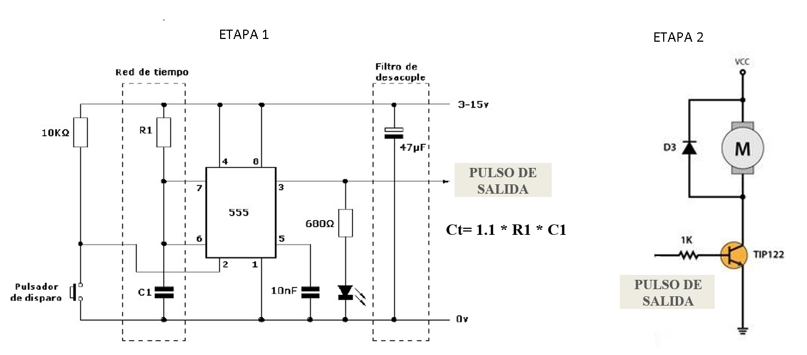
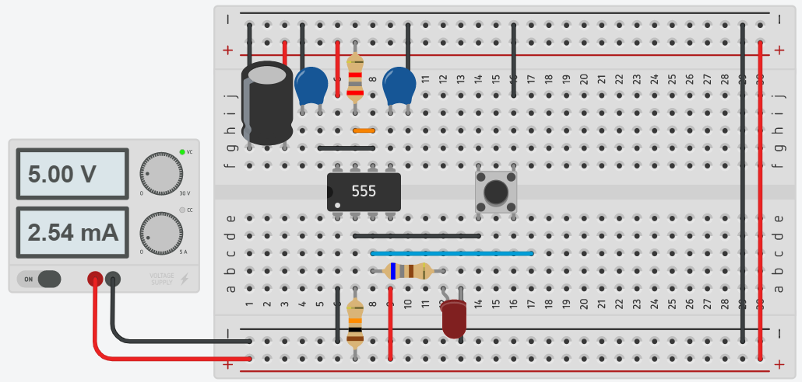
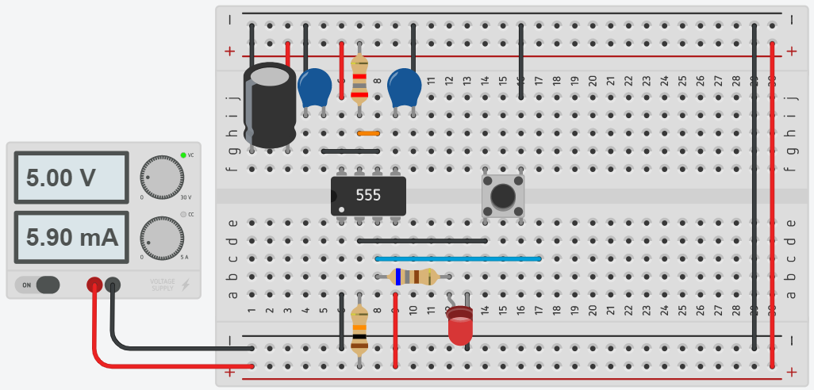
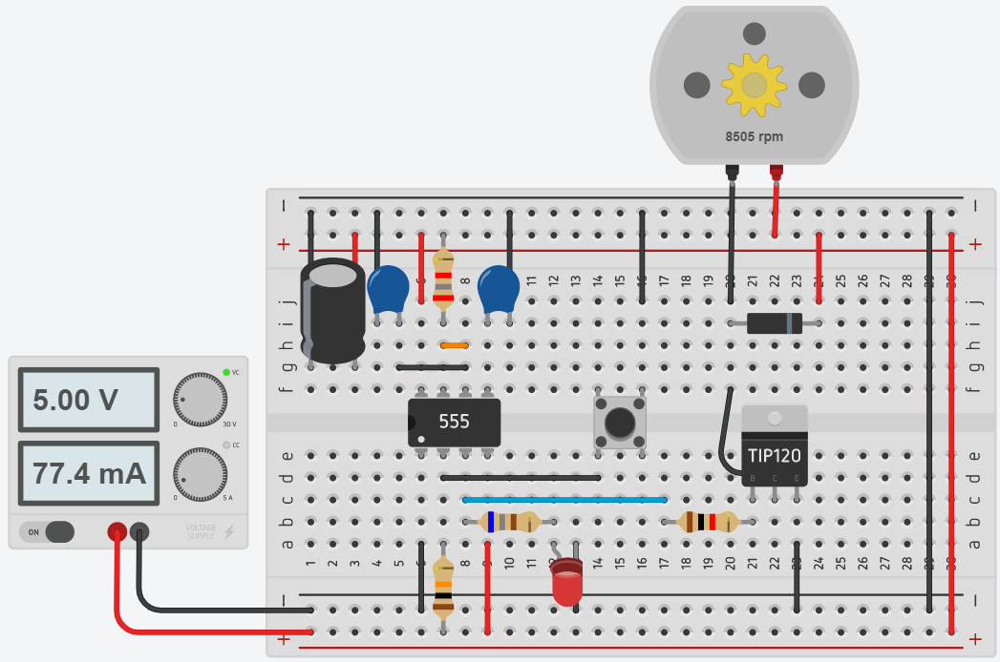
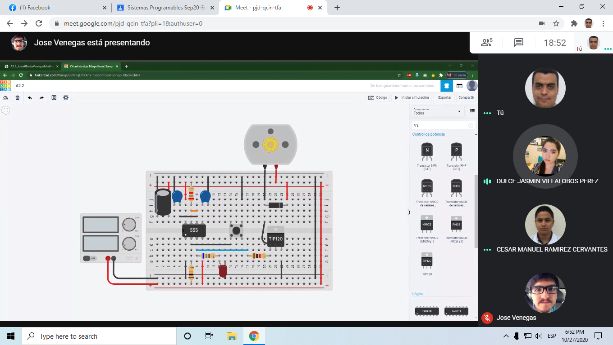
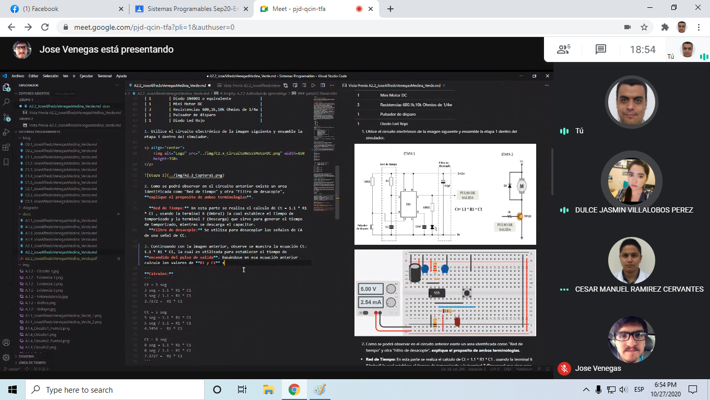
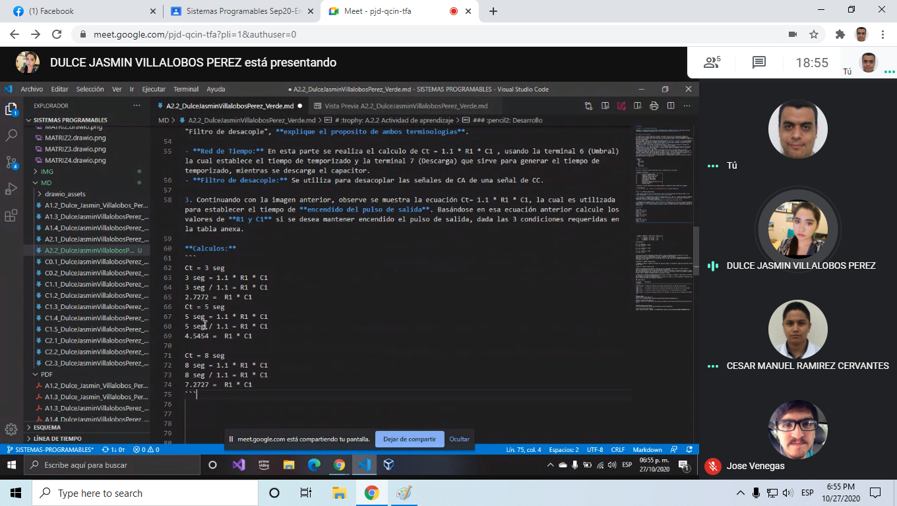
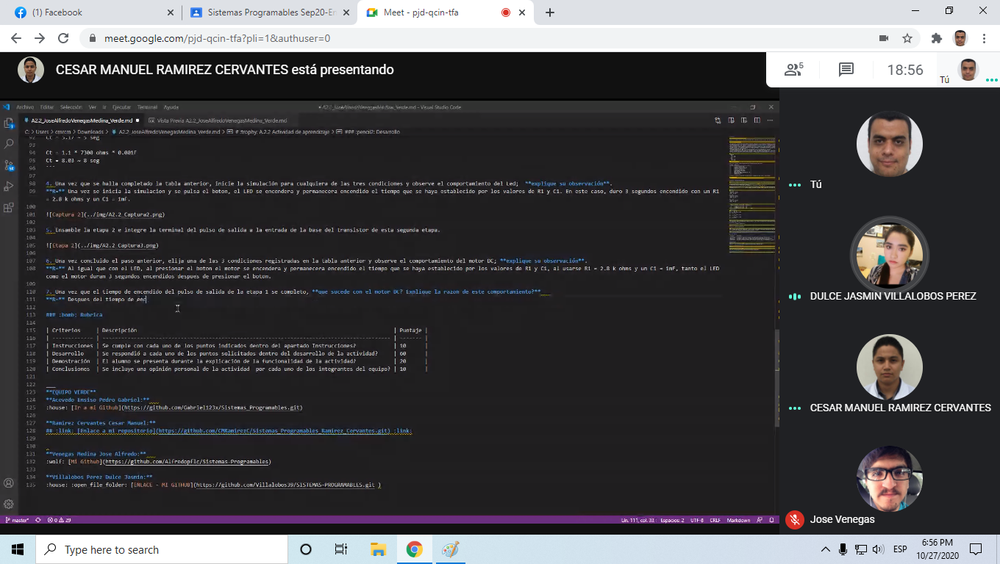

# Actuadores

# :trophy: A.2.2 Actividad de aprendizaje

 Realizar un sistema de control de arranque y encendido para un actuador eléctrico a través de un circuito electrónico, utilizando un simulador, un **Temporizador NE55s** y un **Motor de DC**.


### :blue_book: Instrucciones

- Se sugiere para el desarrollado de la presenta actividad, utilice uno de los siguientes simuladores: [Autodesk Tinkercad](https://www.tinkercad.com/), [Virtual BreadBoard](http://www.virtualbreadboard.com/), [Easy EDA](https://easyeda.com/) por lo cual habrá que familiarizarse antes, e incluso instalarse o registrarse dentro de la plataforma.
- Toda actividad o reto se deberá realizar utilizando el estilo **MarkDown con extension .md** y el entorno de desarrollo VSCode, debiendo ser elaborado como un documento **single page**, es decir si el documento cuanta con imágenes, enlaces o cualquier documento externo debe ser accedido desde etiquetas y enlaces, y debe ser nombrado con la nomenclatura **A2.2_NombreApellido_Equipo.pdf.**
- Es requisito que el .md contenga una etiqueta del enlace al repositorio de su documento en GITHUB, por ejemplo **Enlace a mi GitHub** y al concluir el reto se deberá subir a github.
- Desde el archivo **.md** exporte un archivo **.pdf** que deberá subirse a classroom dentro de su apartado correspondiente, sirviendo como evidencia de su entrega, ya que siendo la plataforma **oficial** aquí se recibirá la calificación de su actividad.
- Considerando que el archivo .PDF, el cual fue obtenido desde archivo .MD, ambos deben ser idénticos.
- Su repositorio ademas de que debe contar con un archivo **readme**.md dentro de su directorio raíz, con la información como datos del estudiante, equipo de trabajo, materia, carrera, datos del asesor, e incluso logotipo o imágenes, debe tener un apartado de contenidos o indice, los cuales realmente son ligas o **enlaces a sus documentos .md**, _evite utilizar texto_ para indicar enlaces internos o externo.
- Se propone una estructura tal como esta indicada abajo, sin embargo puede utilizarse cualquier otra que le apoye para organizar su repositorio.
  
```
- readme.md
  - blog
    - C2.1_x.md
    - C2.2_x.md
  - img
  - docs
    - A2.1_x.md
    - A2.2_x.md
```
### :pencil2: Desarrollo

1.Utilice el siguiente listado de materiales para la elaboración de la actividad

| Cantidad | Descripción                            |
| -------- | -------------------------------------- |
| 1        | [Circuito integrado LM555](https://www.mecatronicalatam.com/es/tutoriales/electronica/componentes-electronicos/555/)               |
| 1        | [Capacitor electrolítico de 47uf](https://www.digikey.com.mx/products/es/capacitors/3?keywords=radial&utm_adgroup=General&utm_source=google&utm_medium=cpc&utm_campaign=ES_Product_Capacitors_MBR&utm_term=%2Bcapacitor%20%2Bradial&productid=&gclid=Cj0KCQjwreT8BRDTARIsAJLI0KJwHRsPq5-e4KKR51ZxucXeiR-swZ18-V-vlsST9ZDKlJuvlfpblugaAiuVEALw_wcB)        |
| 1        | [Condensador cerámico de 10nf](https://electronica.mercadolibre.com.mx/capacitor-ceramico-10nf)          |
| 1        | [Fuente de voltaje de 9V](https://electronica.mercadolibre.com.mx/fuente-9v)               |
| 1        | [Transistor de poder TIP122](https://sandorobotics.com/producto/tip122/)             |
| 1        | [Diodo 1N4001 o equivalente](https://articulo.mercadolibre.com.mx/MLM-599767114-diodo-rectificador-1n4001-4001-cdmx-electronica-_JM?matt_tool=65873753&matt_word=&matt_source=google&matt_campaign_id=6557890781&matt_ad_group_id=79310952475&matt_match_type=&matt_network=u&matt_device=c&matt_creative=385554255498&matt_keyword=&matt_ad_position=&matt_ad_type=&matt_merchant_id=117915919&matt_product_id=MLM599767114&matt_product_partition_id=353037831509&matt_target_id=pla-353037831509&gclid=Cj0KCQjwreT8BRDTARIsAJLI0KL9tLvd26TFBlnL-DtpOWUpouE9nJt7klUGu4131RZqir0qHzXEBtQaAtjwEALw_wcB)             |
| 1        | [Mini Motor DC](https://articulo.mercadolibre.com.mx/MLM-657222655-motor-dc-3v-5v-_JM?matt_tool=65873753&matt_word=&matt_source=google&matt_campaign_id=6557890781&matt_ad_group_id=79310952475&matt_match_type=&matt_network=u&matt_device=c&matt_creative=385554255498&matt_keyword=&matt_ad_position=&matt_ad_type=&matt_merchant_id=117474830&matt_product_id=MLM657222655&matt_product_partition_id=353037831509&matt_target_id=pla-353037831509&gclid=Cj0KCQjwreT8BRDTARIsAJLI0KIEf0HqqIhedzl9fMdim1CB5sxP23rCSKCZs0nhOQtuKuLRIUYnuWAaAmqeEALw_wcB)                          |
| 3        | [Resistencias 680,1k,10k Ohmios de 1/4w](https://articulo.mercadolibre.com.mx/MLM-660627026-200-resistencias-14-w-1-pelicula-metalica-varios-valores-_JM#position=2&type=item&tracking_id=bf7642c1-9632-43d4-96ab-1ce869d8ef03) |
| 1        | [Pulsador de disparo](https://articulo.mercadolibre.com.mx/MLM-790917329-20-piezas-push-button-2-pines-boton-pulsador-6x6x5mm-_JM#position=5&type=item&tracking_id=08c724a1-2271-40e6-af67-1576f7f33303)                    |
| 1        | [Diodo Led Rojo](https://articulo.mercadolibre.com.mx/MLM-638512019-100-leds-difusos-5mm-rojo-ambar-azul-verde-blanco-_JM#position=10&type=item&tracking_id=a3aa5f51-9283-408c-be89-a261a2ddf25f)                         |


1. Utilice el circuito electrónico de la imagen siguiente y ensamble la etapa 1 dentro del simulador.

<p align="center">
    
</p>



2. Como se podrá observar en el circuito anterior existe un area identificada como "Red de tiempo" y otra "Filtro de desacople", **explique el proposito de ambos terminologias**.

- **Red de Tiempo:** En esta parte se realiza el calculo de Ct = 1.1 * R1 * C1 , usando la terminal 6 (Umbral) la cual establece el tiempo de temporizado y la terminal 7 (Descarga) que sirve para generar el tiempo de temporizado, mientras se descarga el capacitor.
- **Filtro de desacople:** Se utiliza para desacoplar las señales de CA de una señal de CC.

3. Continuando con la imagen anterior, observe se muestra la ecuación Ct= 1.1 * R1 * C1, la cual es utilizada para establecer el tiempo de **encendido del pulso de salida**. Basándose en esa ecuación anterior calcule los valores de **R1 y C1** si se desea mantener encendido el pulso de salida, dada las 3 condiciones requeridas en la tabla anexa.

**Calculos:**
```
Ct = 3 seg
3 seg = 1.1 * R1 * C1
3 seg / 1.1 = R1 * C1
2.7272 =  R1 * C1

Ct = 5 seg
5 seg = 1.1 * R1 * C1
5 seg / 1.1 = R1 * C1
4.5454 =  R1 * C1

Ct = 8 seg
8 seg = 1.1 * R1 * C1
8 seg / 1.1 = R1 * C1
7.2727 =  R1 * C1
```


  | Numero | Condición  | Valor de R1 | Valor de C1 |
  | ------ | ---------- | ----------- | ----------- |
  | 1      | 3 segundos | 2.8 k ohms  | 1 mF        |
  | 2      | 5 segundos | 4.7 k ohms  | 1 mF        |
  | 3      | 8 segundos | 7.3 k ohms  | 1 mF        |    

**Comprobacion:**
```
Ct = 1.1 * R1 * C1
Ct = 1.1 * 2800 ohms * 0.001F
Ct = 3.08 ~ 3 seg

Ct = 1.1 * 4700 ohms * 0.001F
Ct = 5.17 ~ 5 seg

Ct = 1.1 * 7300 ohms * 0.001F
Ct = 8.03 ~ 8 seg
```

4. Una vez que se halla completado la tabla anterior, inicie la simulación para cualquiera de las tres condiciones y observe el comportamiento del Led;  **explique su observación**.  
**R=** Una vez se inicia la simulacion y se pulsa el boton, el LED se encendera y permanecera encendido el tiempo que se haya establecido por los valores de R1 y C1. En este caso, duro 3 segundos encendido con un R1 = 2.8 k ohms y un C1 = 1mF.  



5. Ensamble la etapa 2 e integre la terminal del pulso de salida a la entrada de la base del transistor de esta segunda etapa.  

  

6. Una vez concluido el paso anterior, elija una de las 3 condiciones registradas en la tabla anterior y observe el comportamiento del motor DC; **explique su observación**.  
**R=** Al igual que con el LED, al presionar el boton el motor se encendera y permanecera encendido el tiempo que se haya establecido por los valores de R1 y C1, al usarse R1 = 2.8 k ohms y un C1 = 1mF, tanto el LED como el motor duran 3 segundos encendidos despues de presionar el boton.  

7. Una vez que el tiempo de encendido del pulso de salida de la etapa 1 se completo, **que sucede con el motor DC? Explique la razon de este comportamiento?**   
**R=** Despues del tiempo de encendido del pulso de salida de la etapa 1, el motor igualmente se detiene ya que deja de recibir una señal en la base del transistor.

8. Inserte imágenes de evidencias tales como son reuniones de los integrantes del equipo realizadas para el desarrollo de la actividad.






9. Incluya las conclusiones individuales y resultados observados durante el desarrollo de la actividad.

- Acevedo Ensiso Pedro Gabriel:  
Con el circuito temporizador utilizando el LM555 podemos diseñar circuitos que operen una cierta cantidad de tiempo al ser activados, lo cual nos permite controlar actuadores o sistemas automáticos con los que podemos controlar cosas como puertas, alarmas, sistemas de riego, etc. El circuito diseñado en la práctica es muy sencillo y pequeño lo cual lo hace muy flexible en su implementación, con el uso de unos cálculos simples podemos determinar por cuánto tiempo queremos que el circuito esté activo después de ser accionado. en cuanto a los resultados vistos en la práctica el acomodo de componentes fue muy sencillo y el cálculo de R1 y C1 para la red de tiempo se obtuvo a través de un simple despeje y proposición de valores consecuentes.

- Ramirez Cervantes Cesar Manuel:  
Como se pudo observar en esta practica se realizo un circuito que con ayuda de un temporizador LM555, es capaz de hacer girar un motor de corriente directa en un determinado tiempo que es regulado gracias a las resistencias y capacitores. Dichos capacitores y resistencias fueron calculados sus valores necesarios mediante la ecuacion de la red de tiempo que nos dice que Ct = 1.1 * Resistencia * Capacitor. Para tener un indicador que que efectivamente el motor gira se integro un LED en el circuito que permanece encendido mientras se mantenga encendido el pulso de salida del temporizador.

- Venegas Medina Jose Alfredo:  
Gracias al circuito integrado LM555 es posible que podamos hacer retardos de tiempo, ya que es un temporizador electrico y tiene una amplia variedad detareas que pueden realizarse con respecto al tiempo. Como pudimos ver, con la formula Ct= 1.1 * R1 * C1, se es posible establecer un tiempo de retardo para el circuito y hacer que un actuador (en este
caso un LED y un motor) puedan seguir encendidos por un lapso de tiempo calculado. Esto gracias a la red de tiempo que establece y genera el tiempo temporizado, y el Filtro de desacople para transformar las señales CA a una señal CC. Algunas aplicaciones para el LM555 es el uso de alarmas, temporizadores, control de un servomotor, detectores, entre otros

- Villalobos Perez Dulce Jasmin:  
Esta actividad dejó más claro el funcionamiento del temporizador, ya que vimos la modulación de la señal y como funcionaba con respecto al tiempo, por ejemplo cuando pulsábamos el botón y el led se encendía, este duraba el encendido el tiempo qué habíamos calculado, su tiempo varía dependiendo del valor de la resistencia ya qué para la práctica dejamos el valor del capacitar como 1 mF, gracias a esto me quedo más clara la teoría vista, ahora bien cuando conectamos un motor al circuito se vio qué este se detenía al luego, luego casi al mismo tiempo qué al momento qué se apagaba el led.

### :bomb: Rubrica

| Criterios     | Descripción                                                                                  | Puntaje |
| ------------- | -------------------------------------------------------------------------------------------- | ------- |
| Instrucciones | Se cumple con cada uno de los puntos indicados dentro del apartado Instrucciones?            | 10      |
| Desarrollo    | Se respondió a cada uno de los puntos solicitados dentro del desarrollo de la actividad?     | 60      |
| Demostración  | El alumno se presenta durante la explicación de la funcionalidad de la actividad?            | 20      |
| Conclusiones  | Se incluye una opinión personal de la actividad  por cada uno de los integrantes del equipo? | 10      |

___
**EQUIPO VERDE**  
**Acevedo Ensiso Pedro Gabriel:**   
:house: [Ir a mi Github](https://github.com/Gabriel123x/Sistemas_Programables.git)

**Ramirez Cervantes Cesar Manuel:**  
## :link: [Enlace a mi repositorio](https://github.com/CMRamirezC/Sistemas_Programables_Ramirez_Cervantes.git) :link:


**Venegas Medina Jose Alfredo:**   
:wolf: [Mi Github](https://github.com/Alfredopflc/Sistemas-Programables)

**Villalobos Perez Dulce Jasmin:**  
:house: :open_file_folder: [ENLACE - MI GITHUB](https://github.com/Villalobos39/SISTEMAS-PROGRAMABLES.git )