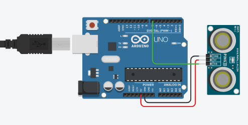

# :trophy: A.3.1 Actividad de aprendizaje

Circuito sensor de detección de objetos, utilizando un Arduino, un sensor ultrasonico y un Display I2C LCD 16x2.
___

## Instrucciones

* Realizar un sistema simulado, capaz de detectar la presencia y/o ausencia de un objeto, a través de un circuito electrónico, utilizando un Arduino, y un **Sensor Ultrasonico HC-SR04**.
* Toda actividad o reto se deberá realizar utilizando el estilo **MarkDown con extension .md** y el entorno de desarrollo VSCode, debiendo ser elaborado como un documento **single page**, es decir si el documento cuanta con imágenes, enlaces o cualquier documento externo debe ser accedido desde etiquetas y enlaces, y debe ser nombrado con la nomenclatura **A3.1_NombreApellido_Equipo.pdf.**
* Es requisito que el .md contenga una etiqueta del enlace al repositorio de su documento en GITHUB, por ejemplo **Enlace a mi GitHub** y al concluir el reto se deberá subir a github.
* Desde el archivo **.md** exporte un archivo **.pdf** que deberá subirse a classroom dentro de su apartado correspondiente, sirviendo como evidencia de su entrega, ya que siendo la plataforma **oficial** aquí se recibirá la calificación de su actividad.
* Considerando que el archivo .PDF, el cual fue obtenido desde archivo .MD, ambos deben ser idénticos.
* Su repositorio ademas de que debe contar con un archivo **readme**.md dentro de su directorio raíz, con la información como datos del estudiante, equipo de trabajo, materia, carrera, datos del asesor, e incluso logotipo o imágenes, debe tener un apartado de contenidos o indice, los cuales realmente son ligas o **enlaces a sus documentos .md**, _evite utilizar texto_ para indicar enlaces internos o externo.
* Se propone una estructura tal como esta indicada abajo, sin embargo puede utilizarse cualquier otra que le apoye para organizar su repositorio.
  
```
* readme.md
  - blog
    - C3.1_TituloActividad.md
    - C3.2_TituloActividad.md
    - C3.3_TituloActividad.md
    - C3.4_TituloActividad.md
    - C3.5_TituloActividad.md
    - C3.6_TituloActividad.md
    - C3.7_TituloActividad.md
    - C3.8_TituloActividad.md
  - img
  - docs
    - A3.1_TituloActividad.md
    - A3.2_TituloActividad.md
    - A3.3_TituloActividad.md
```
___

## Desarrollo

1. Utilizar el siguiente listado de materiales para la elaboración de la actividad

| Cantidad | Descripción                                                                                                                                                                                                                        |
| -------- | ---------------------------------------------------------------------------------------------------------------------------------------------------------------------------------------------------------------------------------- |
| 1        | Sensor [Ultrasonico HC-SR04](https://www.amazon.com.mx/SainSmart-HC-SR04-Ranging-Detector-Distance/dp/B004U8TOE6/ref=sr_1_5?__mk_es_MX=%C3%85M%C3%85%C5%BD%C3%95%C3%91&dchild=1&keywords=hc-sr04&qid=1599005012&sr=8-5)  |
| 1         | [Display LCD de 16x2](https://www.steren.com.mx/display-lcd-2x16.html)
| 1        | [Fuente de voltaje de 5V](http://www.handsontec.com/dataspecs/mb102-ps.pdf)            |
| 1        | [1 Potenciómetro 10k ](https://www.amazon.com.mx/Uxcell-a15011600ux0235-Linear-Rotary-Potentiometer/dp/B01DKCUVMQ/ref=sr_1_1?__mk_es_MX=%C3%85M%C3%85%C5%BD%C3%95%C3%91&dchild=1&keywords=potenciometro+10k&qid=1599005041&sr=8-1)   |
| 1        | [Arduino UNO](https://www.amazon.com.mx/Progressive-Automations-LC-066-Arduino-Rev3/dp/B00WH5XOJK/ref=sr_1_7?__mk_es_MX=%C3%85M%C3%85%C5%BD%C3%95%C3%91&dchild=1&keywords=arduino+uno&qid=1599005073&sr=8-7)   |

1. Basado en la imágen que se muestra, ensamble dentro del simulador a utilizar, el circuito electrónico indicado en la **Figura 1**.

<p align="center"> 
    <strong>Figura 1 Sensor Ultrasonico</strong>
    
</p>


2. Realice el programa que permita a través de una de las entradas del Arduino, recibir el valor que registra el **Sensor Ultrasonico** al acercarse un objeto a distintas distancias.


3. Considerando que el sensor ultrasonico tiene un rango mínimo y máximo de detección basado en el tiempo de retorno de la señal sonica, que valores se obtienen en la simulación bajo las **siguientes condiciones:**

| Numero | Condición 1                   | Condición2                                 | El objeto es detectado? |
| ------ | ----------------------------- | ------------------------------------------ | ----------------------- |
| 1      | 5 cm de distancia al sensor   | 0 grados al eje perpendicular del sensor   | Si
| 2      | 50 cm de distancia al sensor  | 35 grados al eje perpendicular del sensor  | No
| 3      | 100 cm de distancia al sensor | -35 grados al eje perpendicular del sensor | No
| 4      | 5 cm de distancia al sensor   | 90 grados al eje perpendicular del sensor  | No
| 5      | 50 cm de distancia al sensor  | -60 grados al eje perpendicular del sensor | No
| 6      | 350 cm de distancia al sensor | 0 grados al eje perpendicular del sensor   | No

**1:**
  

**2:**
  

**3:**
  

**4:**
  

**5:**
  

**6:**
  

4. Una vez completados los puntos anteriores, agregue a la Figura 1, **un Display I2C 16x2 LCD**, y coloque la imagen del circuito completado hasta este apartado.  

  

5. Al haber completado la integración del Display I2C, ajuste el programa que le permita a través del display mostrar el siguiente mensaje, **"Objetivo detectado a ? cm** , y en caso de no lograr la detección indicar el mensaje **"Objetivo fuera de rango"**  

  


6. Coloque aqui evidencias que considere importantes durante el desarrollo de la actividad.

  
  
  


7. Conclusiones:
- **Acevedo Ensiso Pedro Gabriel:**  
Dentro de esta práctica armamos un circuito donde detectamos un objeto y calculamos su distancia utilizando un sensor ultrasónico utilizando un simulador, la manera en que armamos este circuito va altamente relacionado con el código, primero instanciamos un objeto de la clase "LiquidCrystal" a la cual llamamos "lcd" a la hora de instanciar utilizamos la siguiente sintaxis: LiquidCrystal(rs, enable, d4, d5, d6, d7), aquí introducimos qué pines utilizaremos dentro arduino y los conectamos en su lugar correspondiente en el display LCD. En cuanto al sensor decidimos utilizar los pines 12 y 13 de nuestro Arduino los cuales serán nuestro trigger y echo respectivamente. En cuanto al resto de los pines simplemente los conectamos a su respectiva alimentación y tierra lógica según lo indique la ficha técnica.
Algo curioso que cabe mencionar es que el sensor es capaz de detectar objetos hasta 350 cm en vida real, pero en el simulador solo detecta objetos a una distancia máxima de 320 cm (aproximadamente) lo cual puede causar resultados curiosos, también hay que mencionar que los ángulos de funcionamiento del sensor ultrasónico son de 15 grados (cono de 30 grados) máximos en vida real, pero el simulador permite detectar objetos que se encuentran a 30 grados (cono de 60 grados). 

- **Ramirez Cervantes Cesar Manuel:**  
Como podemos observar con el siguiente circuito somos capaces de detectar objetos que se encuentren dentro del rango de funcionamiento del circuito ultrasónico y al ser detectado podemos hacer funcionar diversos mecanismos en respuesta a la distancia encontrada, en este caso usamos un display lcd para mostrar la distancia a la que se encuentra el objeto, aunque en vida real el HC-SR04 tiene un rango de funcionamiento de hasta 400 cm y un angulo de deteccion de 15 grados y en el simulador en tinkercad encontramos que tenemos un ángulo de 35 grados y un rango de 330cm, esto ocasionó algunas discrepancias en los resultados comparado con un ultrasonico real.

- **Venegas Medina Jose Alfredo:**    
Primeramente, realizamos un circuito en el simulador de Tinkercad, este fue sencillo de hacer, ya que anteriormente habíamos expuesto este tipo de sensor en la actividad A1.3, pudimos comprobar que este sensor manda y regresa sonido, es decir, usa la acústica para poder detectar la distancia de un objeto determinado. Luego de esto, desarrollamos el código para su implementación con Arduino, el cual declarábamos los pines de Tigger como salida y Echo como entrada. Así el Arduino detectara cuanto tiempo tardara el sensor en regresar la señal, una vez con el tiempo establecido, lo dividimos por 58.4 y obtuvimos la distancia. Un detalle que notamos, fue que el sensor tiene un ángulo de 30 grados, es decir de 15 a -15 (perpendicularmente), por lo tanto no deberían poder detectar las distancias 2, 3, 4 y 5, pero por otro lado, las distancias 1 y 6 si deberían poderse detectar según el datasheet del sensor, no obstante, el sensor simulado en Tinkercad solo detecta una distancia máxima de 336 cm aproximadamente y, ya que el sensor debería poder llegar a los 400 cm, podemos concluir que hay una diferencia grande en el simulador. Después agregamos un LCD por medio de la librería "LiquidCrystal", este fue un poco más complicado de controlar, ya que se desconocía su implementación, se agregó un potenciómetro para controlar el brillo de led del display y se programó para que imprimiera a que distancia en cm se encontraba el objeto del sensor, si estaba fuera entonces el LCD mostraría "Objetivo fuera de rango".

- **Villalobos Perez Dulce Jasmin:**  
Para la realización de la actividad primero identificamos los materiales qué usaríamos en la práctica, y lo simulamos en tinkercad, al realizar la primera parte, medimos la distancia a la qué se encontraban los objetos a ciertos grados, para ello escribimos la fórmula para calcular la distasia en el código, luego llenamos la tabla de acuerdo a lo qué fuimos observando, a mover el objeto note que se salía del rango de visualización del sensor ultrasónico ya qué como sabemos va de 2 cm a 400 aprox., pero dentro de la práctica el simulador solo detecta hasta 335 cm aprox. . Entonces determinamos qué ciertas condiciones no eran posible identificar el objeto, luego con ayuda de un video conectamos el display, y añadimos al código la parte de imprimir los mensajes por eso específica las dimensiones (ancho y alto) de la pantalla, pero antes añadimos una librería para el número del pin que está conectado al pin RS e hicimos uso de las funciones.
___

### :bomb: Rubrica

| Criterios     | Descripción                                                                                  | Puntaje |
| ------------- | -------------------------------------------------------------------------------------------- | ------- |
| Instrucciones | Se cumple con cada uno de los puntos indicados dentro del apartado Instrucciones?            | 10      |
| Desarrollo    | Se respondió a cada uno de los puntos solicitados dentro del desarrollo de la actividad?     | 60      |
| Demostración  | El alumno se presenta durante la explicación de la funcionalidad de la actividad?            | 20      |
| Conclusiones  | Se incluye una opinión personal de la actividad  por cada uno de los integrantes del equipo? | 10      |

___
**EQUIPO VERDE**  
**Acevedo Ensiso Pedro Gabriel:**   
:house: [Ir a mi Github](https://github.com/Gabriel123x/Sistemas_Programables.git)

**Ramirez Cervantes Cesar Manuel:**  
## :link: [Enlace a mi repositorio](https://github.com/CMRamirezC/Sistemas_Programables_Ramirez_Cervantes.git) :link:


**Venegas Medina Jose Alfredo:**   
:wolf: [Mi Github](https://github.com/Alfredopflc/Sistemas-Programables)

**Villalobos Perez Dulce Jasmin:**  
:house: :open_file_folder: [ENLACE - MI GITHUB](https://github.com/Villalobos39/SISTEMAS-PROGRAMABLES.git )