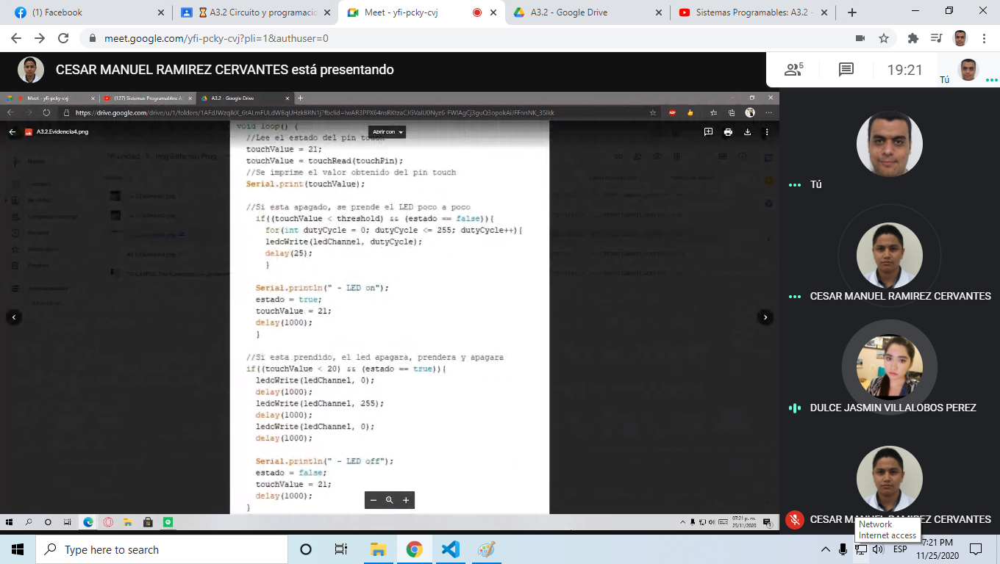

# :trophy: A.3.2 Actividad de aprendizaje

Circuito sensor de tacto a través de un NodeMCU ESP32
___

## Instrucciones

- Basado en la figura 1, ensamblar un sistema, capaz de responder al tacto, a través de un circuito electrónico, utilizando un NodeMCU **ESP32**, un  **Sensor de tacto capacitivo**.
- Toda actividad o reto se deberá realizar utilizando el estilo **MarkDown con extension .md** y el entorno de desarrollo VSCode, debiendo ser elaborado como un documento **single page**, es decir si el documento cuanta con imágenes, enlaces o cualquier documento externo debe ser accedido desde etiquetas y enlaces, y debe ser nombrado con la nomenclatura **A3.2_NombreApellido_Equipo.pdf.**
- Es requisito que el .md contenga una etiqueta del enlace al repositorio de su documento en GITHUB, por ejemplo **Enlace a mi GitHub** y al concluir el reto se deberá subir a github.
- Desde el archivo **.md** exporte un archivo **.pdf** que deberá subirse a classroom dentro de su apartado correspondiente, sirviendo como evidencia de su entrega, ya que siendo la plataforma **oficial** aquí se recibirá la calificación de su actividad.
- Considerando que el archivo .PDF, el cual fue obtenido desde archivo .MD, ambos deben ser idénticos.
- Su repositorio ademas de que debe contar con un archivo **readme**.md dentro de su directorio raíz, con la información como datos del estudiante, equipo de trabajo, materia, carrera, datos del asesor, e incluso logotipo o imágenes, debe tener un apartado de contenidos o indice, los cuales realmente son ligas o **enlaces a sus documentos .md**, _evite utilizar texto_ para indicar enlaces internos o externo.
- Se propone una estructura tal como esta indicada abajo, sin embargo puede utilizarse cualquier otra que le apoye para organizar su repositorio.
  
```
- readme.md
  - blog
    - C3.1_TituloActividad.md
    - C3.2_TituloActividad.md
    - C3.3_TituloActividad.md
    - C3.4_TituloActividad.md
    - C3.5_TituloActividad.md
    - C3.6_TituloActividad.md
    - C3.7_TituloActividad.md
    - C3.8_TituloActividad.md
  - img
  - docs
    - A3.1_TituloActividad.md
    - A3.2_TituloActividad.md
    - A3.3_TituloActividad.md
```
___

### Fuentes de apoyo para desarrollar la actividad

- [x] [Sensor de tacto capacitivo](https://randomnerdtutorials.com/esp32-touch-pins-arduino-ide/)
- [x] [Salida analogica PWM](https://randomnerdtutorials.com/esp32-pwm-arduino-ide/)

___

## Desarrollo

1.Utilice el siguiente listado de materiales para la elaboración de la actividad

| Cantidad | Descripción                                                                                                                                                                                                                |
| -------- | -------------------------------------------------------------------------------------------------------------------------------------------------------------------------------------------------------------------------- |
| 1        | [Diodo led Rojo](https://www.steren.com.mx/led-ultrabrillante-de-5-mm-color-rojo.html)                                                                                                                                                                                                             |
| 1        | [Resistencia 330 ohms](https://www.steren.com.mx/resistencia-de-carbon-de-1-2-watt-al-5-de-tolerancia-de-330-ohms.html)                                                                                                                                                                                                        |
| 1        | [Fuente de voltaje de  5V](https://www.amazon.com.mx/AC-DC-fuente-alimentaci%C3%B3n-Black/dp/B078RXZM4C/ref=asc_df_B078RXZM4C/?tag=gledskshopmx-20&linkCode=df0&hvadid=450926494212&hvpos=&hvnetw=g&hvrand=1295224076675663008&hvpone=&hvptwo=&hvqmt=&hvdev=c&hvdvcmdl=&hvlocint=&hvlocphy=9073855&hvtargid=pla-436418104506&psc=1)                                                                                                                                                                                                     |
| 1        | [NodeMCU ESP32](https://www.amazon.com.mx/ESP-32-ESP-32S-ESP-WROOM-32-ESP32-S-desarrollo/dp/B07TBFC75Z/ref=sr_1_2?__mk_es_MX=%C3%85M%C3%85%C5%BD%C3%95%C3%91&dchild=1&keywords=esp32&qid=1599003438&sr=8-2)                |
| 1        | [BreadBoard](https://www.amazon.com.mx/Deke-Home-Breadboard-distribuci%C3%B3n-electr%C3%B3nica/dp/B086C9HK7V/ref=sr_1_22?__mk_es_MX=%C3%85M%C3%85%C5%BD%C3%95%C3%91&dchild=1&keywords=breadboard&qid=1599003455&sr=8-22)   |
| 1        | [Jumpers M/M](https://www.amazon.com.mx/ELEGOO-Macho-Hembra-Macho-Macho-Hembra-Hembra-Protoboard/dp/B06ZXSQ5WG/ref=sr_1_1?__mk_es_MX=%C3%85M%C3%85%C5%BD%C3%95%C3%91&dchild=1&keywords=jumper+wires&qid=1599003519&sr=8-1) |
| 1        | [Hoja de aluminio](https://www.amazon.com.mx/PAPEL-ALUMINIO-ALUPRACTIK-HOJAS-SHEETS/dp/B08D8QSJXM/ref=asc_df_B08D8QSJXM/?tag=gledskshopmx-20&linkCode=df0&hvadid=450927726949&hvpos=&hvnetw=g&hvrand=14940832341489969278&hvpone=&hvptwo=&hvqmt=&hvdev=c&hvdvcmdl=&hvlocint=&hvlocphy=9073855&hvtargid=pla-1009814023604&psc=1)                                                                                                              


<p align="center"> 
    <strong>Figura 1 Circuito ESP32 IC L293 Motor DC</strong>  
</p>


1. Una vez ensamblado el circuito anterior, realice un programa que permita al ensamble cumplir con las siguientes condiciones:
    - El sistema deberá ser capaz de encender y apagar **un led** al presionar el sensor de tacto.
    - El sistema deberá tener la característica que si el Led esta encendido, al tocar el sensor de tacto, este iniciara un secuencia de intermitencia de 3 segundos (es decir se apaga 1 segundo, se enciende un segundo y se apaga finalmente).
    - El sistema deberá contar con la característica que si el Led esta apagado, al tocar el sensor de tacto, este se encenderá poco a poco hasta llegar a su nivel máximo de iluminación.
2. Coloque aquí evidencias que considere importantes durante el desarrollo de la actividad.
- Evidencia fisica realizada por Jose Alfredo Venegas Medina
- [Presentacion del circuito (VIDEO)](https://youtu.be/VcJHeN5uvJA)


3. Evidencias reuniones.





1. Conclusiones:
- **Acevedo Ensiso Pedro Gabriel:**  
Dentro de esta práctica aprendimos cómo manejar mejor el sensor de tacto para realizar una función específica, en este caso nos referimos al encendido de un LED con diferentes especificaciones. Las especificaciones en este caso son que cuando toquemos el pin el LED se encienda lentamente hasta llegar a su máxima luminosidad y cuando lo toquemos de nuevo este se apague, prenda y apague en ese orden. La importancia de esta práctica es que nosotros podemos aplicar esta salida para algo más importante como un actuador, sistema de seguridad, etc. sistemas que quizá queramos que actúen de una manera específica y gracias  a esta práctica aprendimos de mejor manera las distintas maneras en que podemos hacerlo, también dentro del desarrollo de la práctica aprendí que al manejar voltajes es muy importante siempre asegurar las conexiones antes de probarlas ya que un error puede averiar nuestro esp32 dejandolo inoperable. 

- **Ramirez Cervantes Cesar Manuel:**  
En esta práctica se busco realizar un circuito capaz de captar mediante el pin de un cable el tacto como si se tratase de un componente touch, con esto se debería enviar una señal al ESP32 para que este con ayuda del código desarrollado encendiera un led poco a poco aumentando su intensidad con un retraso de 25 milisegundos. Al llegar al punto de la máxima intensidad del led este debe permanecer encendido hasta que el ESP32 reciba nuevamente una señal del cable por medio del tacto, lo que sucede después es que el del se apagara, no sin antes como muestra de que el led se apagara el led parpadeara una vez para posteriormente apagarse y permanecer así hasta que se vuelva a tocar el pin del cable.

- **Venegas Medina Jose Alfredo:**    
En esta práctica con ayuda de NodeMCU ESP32 y su salida analógica PWM además de su sensor de tacto capacitivo, se pudo controlar el estado de un led, cuando este estuviera apagado, y se tocara el pin touch, la programación le indicaría al LED que se prendiera poco a poco, esto gracias a su salida analógica, ya que iría de un estado 0 a 255 con un retraso de 25 milisegundos por cada estado, y se mantendría prendido. Por otro lado, si el LED estuviera prendido y el pin touch se tocará, entonces el LED iniciara una secuencia de apagado, prendido y apagado finalmente. La práctica se realizó con facilidad, ya que se adaptó de las actividades C3.7 y C3.8, no obstante, se desconocía como mantener el LED en un estado después de que el pin touch sea tocado. Así que se buscaron diferentes maneras para poder realizar el código de forma correcto, siguiendo las especificaciones solicitadas. La solución fue agregar una variable estado, para condicionar cada estado del led y no se ciclara.

- **Villalobos Perez Dulce Jasmin:**  
Para la realización de esta práctica teníamos qué hacer el circuito dado en la actividad, aunque si fue algo diferente la forma de organizarnos ya qué nuestro compañero qué esta a cargo de los materiales, comenzó armar el circuito mientras observábamos como se iban conectando tanto teórico como en físico, en cuanto al código qué se realizó con base en la actividad y el enlace qué proporciono,  en si la actividad tenía qué hacer qué al tocar el touch el led se encendiera y al tocarlo de nuevo el cable qué enlaza a pin del 4 touch se apaga enciende y permanece apagado, esto con base en el código nos dice que usamos el pin 17 GPIO para Pin Led, la parte qué se encarga de qué el led se encienda poco a poco está dentro de la función Loop con el bloque de instrucción donde usamos un if y un ciclo dentro, donde usamos los valores de 0 a 255, y el estado es controlado con un booleano qué nos indica si es esta apagado en false y encendido en true , una vez terminado el ciclo y el Led se apague de nuevo este estado regresa a ser false, para poder evaluar la condición de nuevo al queré encender el Led de nuevo al tocar el pin touch.
___

### :bomb: Rubrica

| Criterios     | Descripción                                                                                  | Puntaje |
| ------------- | -------------------------------------------------------------------------------------------- | ------- |
| Instrucciones | Se cumple con cada uno de los puntos indicados dentro del apartado Instrucciones?            | 10      |
| Desarrollo    | Se respondió a cada uno de los puntos solicitados dentro del desarrollo de la actividad?     | 60      |
| Demostración  | El alumno se presenta durante la explicación de la funcionalidad de la actividad?            | 20      |
| Conclusiones  | Se incluye una opinión personal de la actividad  por cada uno de los integrantes del equipo? | 10      |

___
**EQUIPO VERDE**  
**Acevedo Ensiso Pedro Gabriel:**   
:house: [Ir a mi Github](https://github.com/Gabriel123x/Sistemas_Programables.git)

**Ramirez Cervantes Cesar Manuel:**  
## :link: [Enlace a mi repositorio](https://github.com/CMRamirezC/Sistemas_Programables_Ramirez_Cervantes.git) :link:


**Venegas Medina Jose Alfredo:**   
:wolf: [Mi Github](https://github.com/Alfredopflc/Sistemas-Programables)

**Villalobos Perez Dulce Jasmin:**  
:house: :open_file_folder: [ENLACE - MI GITHUB](https://github.com/Villalobos39/SISTEMAS-PROGRAMABLES.git )