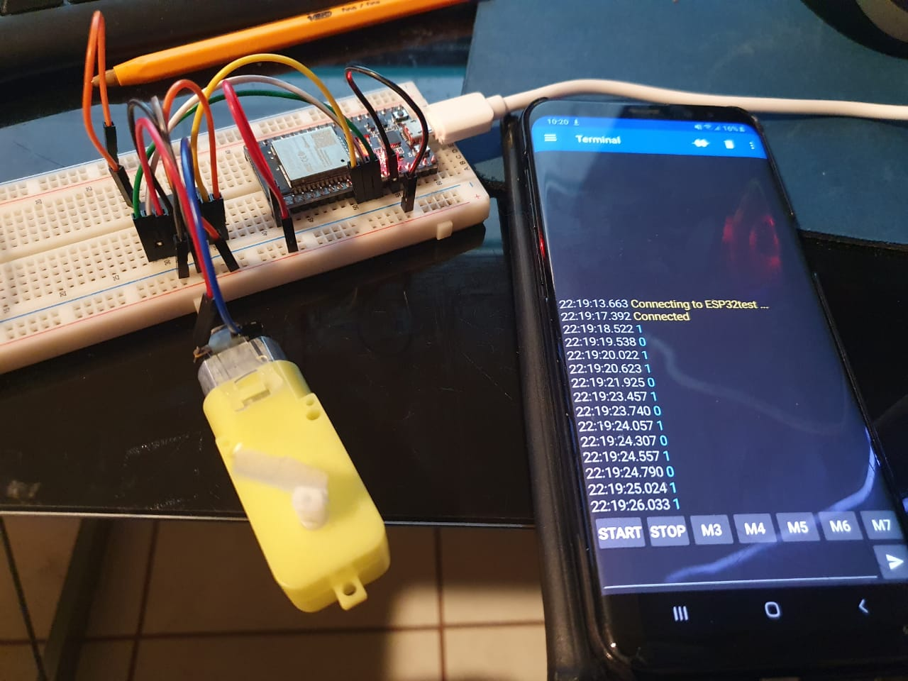
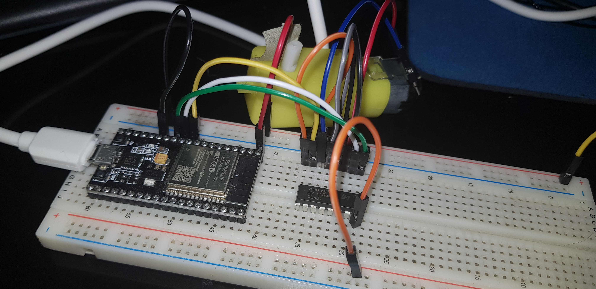
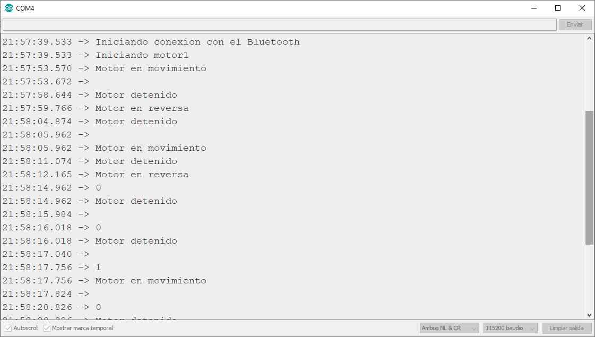
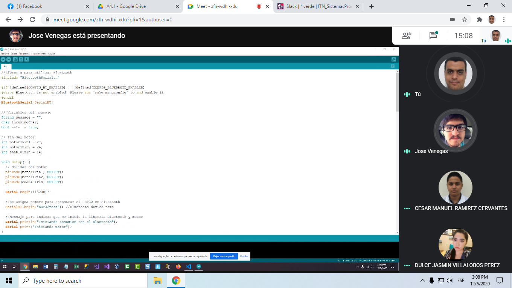
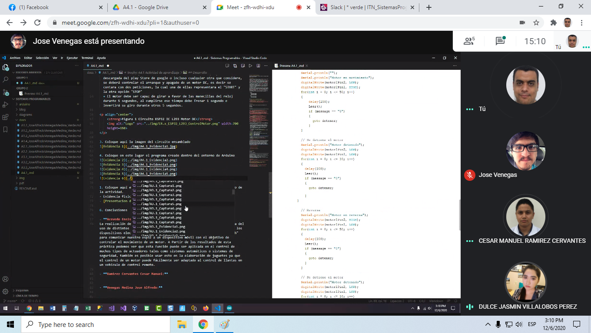
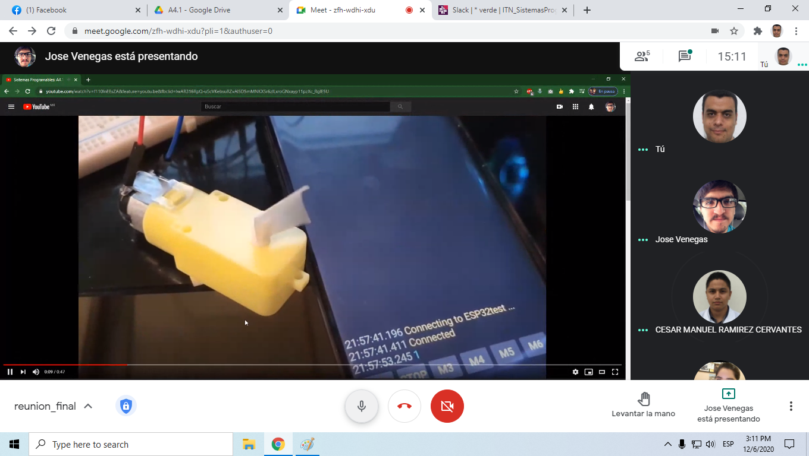
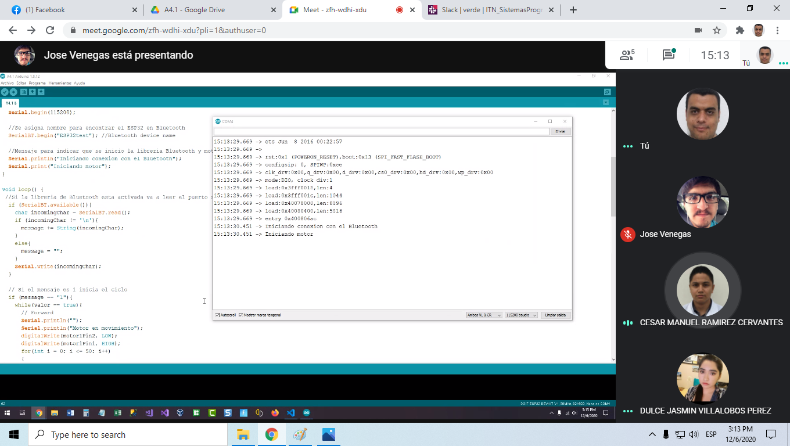

# :trophy: A4.1 Actividad de aprendizaje

Circuito de control para activar y desactivar un motor DC, utilizando  NodeMCU ESP32 por medio de Bluetooth
___

## Instrucciones

- Realizar un sistema ensamblado de control por medio de **Bluetooth**, capaz de control a un motor DC, utilizando un NodeMCU **ESP32**, un y un **IC L293D**.
- Toda actividad o reto se deberá realizar utilizando el estilo **MarkDown con extension .md** y el entorno de desarrollo VSCode, debiendo ser elaborado como un documento **single page**, es decir si el documento cuanta con imágenes, enlaces o cualquier documento externo debe ser accedido desde etiquetas y enlaces, y debe ser nombrado con la nomenclatura **A4.1_NombreApellido_Equipo.pdf.**
- Es requisito que el .md contenga una etiqueta del enlace al repositorio de su documento en GITHUB, por ejemplo **Enlace a mi GitHub** y al concluir el reto se deberá subir a github.
- Desde el archivo **.md** exporte un archivo **.pdf** que deberá subirse a classroom dentro de su apartado correspondiente, sirviendo como evidencia de su entrega, ya que siendo la plataforma **oficial** aquí se recibirá la calificación de su actividad.
- Considerando que el archivo .PDF, el cual fue obtenido desde archivo .MD, ambos deben ser idénticos.
- Su repositorio ademas de que debe contar con un archivo **readme**.md dentro de su directorio raíz, con la información como datos del estudiante, equipo de trabajo, materia, carrera, datos del asesor, e incluso logotipo o imágenes, debe tener un apartado de contenidos o indice, los cuales realmente son ligas o **enlaces a sus documentos .md**, _evite utilizar texto_ para indicar enlaces internos o externo.
- Se propone una estructura tal como esta indicada abajo, sin embargo puede utilizarse cualquier otra que le apoye para organizar su repositorio.
  
```
- readme.md
  - blog
    - C4.1_TituloActividad.md
    - C4.2_TituloActividad.md
    - C4.3_TituloActividad.md
    - C4.4_TituloActividad.md    
  - img
  - docs
    - A4.1_TituloActividad.md
    - A4.2_TituloActividad.md
    - A4.3_TituloActividad.md
```
___

### Fuentes de apoyo para desarrollar la actividad

- [x] [Random Nerd Tutorial DHT Humedad y temperatura](https://randomnerdtutorials.com/esp32-dht11-dht22-temperature-humidity-sensor-arduino-ide/)
- [x] [Motor DC con IC L293 y ESP32](https://www.hackster.io/Oniichan_is_ded/l293d-with-esp32-wemos-lolin-d32-v2-hacked-edition-ea2086)

___

## Desarrollo

1.Utilizar el siguiente listado de materiales para la elaboración de la actividad

| Cantidad | Descripción                                                                                                                                                                                                                |
| -------- | -------------------------------------------------------------------------------------------------------------------------------------------------------------------------------------------------------------------------- |
| 1        | [IC L293D]([https://www.amazon.com.mx/330ohms-M%C3%B3dulo-Sensor-Humedad-Temperatura/dp/B07Q4KWJQY/ref=sr_1_1?__mk_es_MX=%C3%85M%C3%85%C5%BD%C3%95%C3%91&dchild=1&keywords=sensor+dht11&qid=1599003418&sr=8-1)             |
| 1        | [Fuente de voltaje de  5V](https://www.amazon.com.mx/AC-DC-fuente-alimentaci%C3%B3n-Black/dp/B078RXZM4C/ref=asc_df_B078RXZM4C/?tag=gledskshopmx-20&linkCode=df0&hvadid=450926494212&hvpos=&hvnetw=g&hvrand=1295224076675663008&hvpone=&hvptwo=&hvqmt=&hvdev=c&hvdvcmdl=&hvlocint=&hvlocphy=9073855&hvtargid=pla-436418104506&psc=1)    |                                                                                                                                      
| 1        | [NodeMCU ESP32](https://www.amazon.com.mx/ESP-32-ESP-32S-ESP-WROOM-32-ESP32-S-desarrollo/dp/B07TBFC75Z/ref=sr_1_2?__mk_es_MX=%C3%85M%C3%85%C5%BD%C3%95%C3%91&dchild=1&keywords=esp32&qid=1599003438&sr=8-2)                |
| 1        | [BreadBoard](https://www.amazon.com.mx/Deke-Home-Breadboard-distribuci%C3%B3n-electr%C3%B3nica/dp/B086C9HK7V/ref=sr_1_22?__mk_es_MX=%C3%85M%C3%85%C5%BD%C3%95%C3%91&dchild=1&keywords=breadboard&qid=1599003455&sr=8-22)   |
| 1        | [Jumpers M/M](https://www.amazon.com.mx/ELEGOO-Macho-Hembra-Macho-Macho-Hembra-Hembra-Protoboard/dp/B06ZXSQ5WG/ref=sr_1_1?__mk_es_MX=%C3%85M%C3%85%C5%BD%C3%95%C3%91&dchild=1&keywords=jumper+wires&qid=1599003519&sr=8-1) |
| 1         | [Motor DC](https://www.steren.com.mx/motor-reductor-de-doble-eje-tipo-i-3-vcc.html)

2. Basado en las imágenes que se muestran en las **Figura 1**, ensamblar un circuito electrónico, con la finalidad de obtener un sistema capaz de cumplir con las instrucciones siguientes:
   
  + Por medio de la aplicación "Serial Bluetooth terminal" que puede ser descargada del play Store de google o incluso cualquier otra que considere, se deberá controlar el arranque y apagado de un motor DC, es decir se contara con dos peticiones, la cual una de ellas representara el "START" y la otra opción "STOP"
  + El motor debe ser capaz de girar a favor de las manecillas del reloj durante 5 segundos, al cumplirse ese tiempo debe frenar 1 segundo e invertirá su giro durante otros 5 segundos.  
    
<p align="center"> 
    <strong>Figura 1 Circuito ESP32 IC L293 Motor DC</strong>
    
</p>

3. Coloque aqui la imagen del circuito ensamblado



4. Coloque en este lugar el programa creado dentro del entorno de Arduino

```C++
//Libreria para utilizar Bluetooth
#include "BluetoothSerial.h"

#if !defined(CONFIG_BT_ENABLED) || !defined(CONFIG_BLUEDROID_ENABLED)
#error Bluetooth is not enabled! Please run `make menuconfig` to and enable it
#endif
BluetoothSerial SerialBT;

// Variables del mensaje
String message = "";
char incomingChar;
bool valor = true;

// Pin del motor
int motor1Pin1 = 27; 
int motor1Pin2 = 26; 
int enable1Pin = 14; 
 
void setup() {
  // Salidas del motor
  pinMode(motor1Pin1, OUTPUT);
  pinMode(motor1Pin2, OUTPUT);
  pinMode(enable1Pin, OUTPUT);
   
  Serial.begin(115200);

  //Se asigna nombre para encontrar el ESP32 en Bluetooth
  SerialBT.begin("ESP32test"); //Bluetooth device name
  
  //Mensaje para indicar que se inicio la libreria Bluetooth y motor
  Serial.println("Iniciando conexion con el Bluetooth");
  Serial.print("Iniciando motor");  
}
 
void loop() {
 //Si la libreria de Bluetooth esta activada va a leer el puerto serial
  if (SerialBT.available()){
    char incomingChar = SerialBT.read();
    if (incomingChar != '\n'){ 
      message += String(incomingChar);
    }
    else{
      message = "";
    }
    Serial.write(incomingChar);    
  }

  // Si el mensaje es 1 inicia el ciclo 
  if (message == "1"){
    while(valor == true){
      // Forward
      Serial.println("");
      Serial.println("Motor en movimiento");
      digitalWrite(motor1Pin2, LOW);
      digitalWrite(motor1Pin1, HIGH);
      for(int i = 0; i <= 50; i++)
      {
          delay(100); 
          Leer();    
          if (message == "0")
          {
            goto detener;
          }
      }
     
      // Se detiene el motor
      Serial.println("Motor detenido");
      digitalWrite(motor1Pin2, LOW);
      digitalWrite(motor1Pin1, LOW);
      for(int i = 0; i <= 10; i++)
      {
        delay(100);
        Leer(); 
        if (message == "0")
        {
          goto detener;
        }
    }
 
      // Reversa
      Serial.println("Motor en reversa");
      digitalWrite(motor1Pin2, HIGH);
      digitalWrite(motor1Pin1, LOW); 
      for(int i = 0; i <= 50; i++)
      {
        delay(100);
        Leer(); 
        if (message == "0")
        {
          goto detener;
        }
      }
 
      // Se detiene el motor
      Serial.println("Motor detenido");
      digitalWrite(motor1Pin2, LOW);
      digitalWrite(motor1Pin1, LOW);
      for(int i = 0; i <= 10; i++)
      {
        delay(100);
        Leer(); 
        if (message == "0")
        {
          goto detener;
        }
      }
    }
  }
    //Si el mensaje es STOP se apaga el motor
    if (message == "0"){ 
      detener:  
      //valor = false;
      Serial.println("");
      Serial.println("Motor detenido");
      digitalWrite(motor1Pin2, LOW);
      digitalWrite(motor1Pin1, LOW);
      delay(1000);
    }
    delay(20); 
}

void Leer()
{
  if (SerialBT.available()){
    char incomingChar = SerialBT.read();
    if (incomingChar != '\n'){
      message += String(incomingChar);
    }
    else{
      message = "";
    }
    Serial.write(incomingChar); 
  }
}
```



5. Coloque aquí evidencias que considere importantes durante el desarrollo de la actividad.
- Evidencia fisica realizada por: Jose Alfredo Venegas Medina
- [Presentacion del circuito (VIDEO)](https://youtu.be/f110lnEEsZA) 







6. Conclusiones

- **Acevedo Ensiso Pedro Gabriel:**  
La realización de esta práctica me ayudó a comprender mejor la importancia del uso de distintos protocolos de comunicación en los procesos de control de los dispositivos electrónicos, en este caso utilizamos el protocolo "bluetooth" para comunicar nuestro esp32 a un dispositivo móvil con el objetivo de controlar el movimiento de un motor. A Partir de los resultados de esta práctica podemos ver que esta función puede ser aplicada en el control de muchos tipos de actuadores tales como sistemas automáticos o sistemas de seguridad, también es posible usar esto en la elaboración de juguetes ya que el control de un motor puede fácilmente ser adaptado al control de llantas en un vehículo de control remoto. 

- **Ramirez Cervantes Cesar Manuel:**  
Para esta práctica se requería realizar un circuito con el ESP232 que fuera capaz de establecer conexión con un móvil por vía Bluetooth para que a través del dispositivo se enviara una señal al ESP232 y este dependiendo de lo que reciba realizará alguna instrucción, para este caso se debía contar con dos envíos de señal una "START" la cuál daría inicio al circuito, es decir, se activaría el pequeño motor el cual daría durante 5 segundos hacia un sentido seguido se detendrá para después volver a girar pero al sentido opuesto, también la señal de "STOP" la cuál sin importar en qué estado se encuentre el motor (girando en cualquier sentido) este se debe detener por completo, es decir, apagarse el circuito.
Para poder hacer la conexión del motor al ESP232 se utilizó un puente H IC L293 el cual sirve para manejar cargas de potencia media, en especial pequeños motores y cargas inductivas, con la capacidad de controlar corriente hasta 600 mA en cada circuito y una tensión entre 4,5 V a 36 V.

- **Venegas Medina Jose Alfredo:**  
En la realización de esta práctica comprobamos el control de un motor por medio de un puente H y un ESP32 que lo controlaría recibiendo una señal Bluetooth. Para su realización se tuvo que comprender y analizar el funcionamiento de un puente H, ya que se desconocía. Una vez realizada la conexión, lo complejo fue la implementación del código, ya que, aunque hacer el ciclo de giro fue fácil (dar vuelta 5 segundos, detenerse 1 segundo, ir en reversa 5 segundos y detenerse 1 segundo), la duda que teníamos era a la hora de poder detener el motor en cualquier momento, para esto decidimos que únicamente se enviaría un 0 y un 1 de la terminal conectada por Bluetooth al ESP32 para encender y detener el motor. Esto ya que enviar una palabra tardaría más tiempo y por lo tanto el motor tardaría en detenerse una vez haya sido mandada la instrucción. Así que se creó un método que detectara si llegaba un 0 al puerto serial y lo haría cada 100 milisegundos. La aplicación que yo podría encontrar de esto sería en un carro o tal vez un dron a control remoto, donde tú le mandes una señal para detenerlo e igualmente poder mandarle una señal para volverlo a encenderlo.

- **Villalobos Perez Dulce Jasmin:**  
En esta práctica se utilizó un motor de DC un ejemplo sencillo de la aplicación de este motor sería los motores qué usa un carrito de juguete, al usar eso de la conexión de bluetooth para controlar el movimiento, podemos ver cómo se puede controlar desde el uso de un control remoto, gracias a una aplicación, ya que existe una comunicación entre el móvil y la placa con bluetooth, dicho esto para poder usar el bluetooth en la práctica es necesario el uso de una librería qué  nos permite darle uso, en esta práctica se tuvo qué conectar el motor y al Esp32 por medio de un puente IC L293 H, como se muestra en el diagrama,  cuando se trabajó con el código se presentó una pequeña complicación qué si llevo tiempo el encontrar una solución, ya que como sabemos en esta práctica el objetivo era hacer qué el motor se moviera por 5 segundos hacia delante, luego se detiene un segundo y luego va de reversa por otros 5 segundos, luego se vuelve a detener y  sigue hacia delante y así en forma de ciclo, pero una vez resulto esto, al final se logró poder detener  el movimiento del motor en cualquier momento qué se le envía stop con la aplicación.
___

### :bomb: Rubrica

| Criterios     | Descripción                                                                                  | Puntaje |
| ------------- | -------------------------------------------------------------------------------------------- | ------- |
| Instrucciones | Se cumple con cada uno de los puntos indicados dentro del apartado Instrucciones?            | 10      |
| Desarrollo    | Se respondió a cada uno de los puntos solicitados dentro del desarrollo de la actividad?     | 60      |
| Demostración  | El alumno se presenta durante la explicación de la funcionalidad de la actividad?            | 20      |
| Conclusiones  | Se incluye una opinión personal de la actividad  por cada uno de los integrantes del equipo? | 10      |

___
**EQUIPO VERDE**  
**Acevedo Ensiso Pedro Gabriel:**   
:house: [Ir a mi Github](https://github.com/Gabriel123x/Sistemas_Programables.git)

**Ramirez Cervantes Cesar Manuel:**  
## :link: [Enlace a mi repositorio](https://github.com/CMRamirezC/Sistemas_Programables_Ramirez_Cervantes.git) :link:


**Venegas Medina Jose Alfredo:**   
:wolf: [Mi Github](https://github.com/Alfredopflc/Sistemas-Programables)

**Villalobos Perez Dulce Jasmin:**  
:house: :open_file_folder: [ENLACE - MI GITHUB](https://github.com/Villalobos39/SISTEMAS-PROGRAMABLES.git )