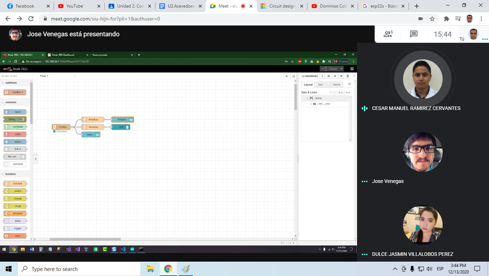

# :trophy: A4.2 Actividad de aprendizaje

Circuito sensor de iluminación y actuación de luz NodeMCU ESP32 por medio de Wi-Fi
___

## Instrucciones

- Realizar un sistema de medición y actuación de luz ambiental, utilizando el protocolo de comunicación **Wi-FI**, asi como un NodeMCU **ESP32**, un sensor  **LDR**, un diodo LED.
- Toda actividad o reto se deberá realizar utilizando el estilo **MarkDown con extension .md** y el entorno de desarrollo VSCode, debiendo ser elaborado como un documento **single page**, es decir si el documento cuanta con imágenes, enlaces o cualquier documento externo debe ser accedido desde etiquetas y enlaces, y debe ser nombrado con la nomenclatura **A4.2_NombreApellido_Equipo.pdf.**
- Es requisito que el .md contenga una etiqueta del enlace al repositorio de su documento en GITHUB, por ejemplo **Enlace a mi GitHub** y al concluir el reto se deberá subir a github.
- Desde el archivo **.md** exporte un archivo **.pdf** que deberá subirse a classroom dentro de su apartado correspondiente, sirviendo como evidencia de su entrega, ya que siendo la plataforma **oficial** aquí se recibirá la calificación de su actividad.
- Considerando que el archivo .PDF, el cual fue obtenido desde archivo .MD, ambos deben ser idénticos.
- Su repositorio ademas de que debe contar con un archivo **readme**.md dentro de su directorio raíz, con la información como datos del estudiante, equipo de trabajo, materia, carrera, datos del asesor, e incluso logotipo o imágenes, debe tener un apartado de contenidos o indice, los cuales realmente son ligas o **enlaces a sus documentos .md**, _evite utilizar texto_ para indicar enlaces internos o externo.
- Se propone una estructura tal como esta indicada abajo, sin embargo puede utilizarse cualquier otra que le apoye para organizar su repositorio.
  
```
- readme.md
  - blog
    - C4.1_TituloActividad.md
    - C4.2_TituloActividad.md
    - C4.3_TituloActividad.md
    - C4.4_TituloActividad.md    
  - img
  - docs
    - A4.1_TituloActividad.md
    - A4.2_TituloActividad.md
    - A4.3_TituloActividad.md
```
___

### Fuentes de apoyo para desarrollar la actividad

   - [x] [ESP32 Web Server](https://randomnerdtutorials.com/esp32-web-server-arduino-ide/)
   - [x] [LDR con ESP32](https://www.youtube.com/watch?v=A3qcN2mzv0Q)
   
___

## Desarrollo

1.Utilizar el siguiente listado de materiales para la elaboración de la actividad

| Cantidad | Descripción    |
| -------- | -------------- |
| 1        | [Modulo Sensor LDR]([https://articulo.mercadolibre.com.mx/MLM-623282168-modulo-sensor-de-luz-ldr-_JM)             |
| 1 | [Rele de 3.3v](https://articulo.mercadolibre.com.mx/MLM-657067999-modulo-relevador-relay-1-canal-12v-_JM#reco_item_pos=0&reco_backend=machinalis-seller-items-pdp&reco_backend_type=low_level&reco_client=vip-seller_items-above&reco_id=76819f32-da5c-4db0-bfd7-c055d4f691ac) |
| 1 | [Bombilla](https://articulo.mercadolibre.com.mx/MLM-686019760-circuito-electrico-led-soquet-foco-broche-para-pila-cuadrada-_JM?matt_tool=48904454&matt_word=&matt_source=google&matt_campaign_id=11714912137&matt_ad_group_id=113017550359&matt_match_type=&matt_network=g&matt_device=c&matt_creative=482511924687&matt_keyword=&matt_ad_position=&matt_ad_type=pla&matt_merchant_id=127133822&matt_product_id=MLM686019760&matt_product_partition_id=353037831509&matt_target_id=pla-353037831509&gclid=Cj0KCQiA8dH-BRD_ARIsAC24uma-W8nDbhygBphkoEROu6oaONkYCyVzrjmB-mrOiBPV7RkPS11BdmIaAu7REALw_wcB)  |
| 1        | [Fuente de voltaje de  5V](https://www.amazon.com.mx/AC-DC-fuente-alimentaci%C3%B3n-Black/dp/B078RXZM4C/ref=asc_df_B078RXZM4C/?tag=gledskshopmx-20&linkCode=df0&hvadid=450926494212&hvpos=&hvnetw=g&hvrand=1295224076675663008&hvpone=&hvptwo=&hvqmt=&hvdev=c&hvdvcmdl=&hvlocint=&hvlocphy=9073855&hvtargid=pla-436418104506&psc=1)                                                                                                      |
| 1        | [NodeMCU ESP32](https://www.amazon.com.mx/ESP-32-ESP-32S-ESP-WROOM-32-ESP32-S-desarrollo/dp/B07TBFC75Z/ref=sr_1_2?__mk_es_MX=%C3%85M%C3%85%C5%BD%C3%95%C3%91&dchild=1&keywords=esp32&qid=1599003438&sr=8-2)                |
| 1        | [BreadBoard](https://www.amazon.com.mx/Deke-Home-Breadboard-distribuci%C3%B3n-electr%C3%B3nica/dp/B086C9HK7V/ref=sr_1_22?__mk_es_MX=%C3%85M%C3%85%C5%BD%C3%95%C3%91&dchild=1&keywords=breadboard&qid=1599003455&sr=8-22)   |
| 1        | [Jumpers M/M](https://www.amazon.com.mx/ELEGOO-Macho-Hembra-Macho-Macho-Hembra-Hembra-Protoboard/dp/B06ZXSQ5WG/ref=sr_1_1?__mk_es_MX=%C3%85M%C3%85%C5%BD%C3%95%C3%91&dchild=1&keywords=jumper+wires&qid=1599003519&sr=8-1) |

2. Basado en la imágen que se muestran en las **Figura 1**, ensamble un circuito electrónico y agregue un Led y un rele a una de las terminales del dispositivo, de tal manera que se pueda obtener un sistema capaz de cumplir con las instrucciones siguiente:
    - Se deberá utilizar el NodeMCU como un **standalone Web server**, el cual deberá proveer una interface visual, que mostrara una imagen representando un comportamiento de "ON y OFF" dependiendo de la condición de iluminación ambiental.
    - El sensor de iluminación deberá estar midiendo la cantidad de luz que existen en el ambiente.
    - Al momento de detectar el sensor LDR, ausencia de luz deberá mostrar en la interface Web un estado "ON", y en caso contrario deberá representarse el estado "OFF".
    - Al circuito de la figura 1 se le deberá agregar un relevador en serie con una bombilla, que sera activada en condición opuesta al estado "ON" y "OFF", es decir una vez que el sensor detecto poca o nula iluminación activara el rele y por consecuencia encenderá la bombilla, y en caso contrario lo apagara.

[Fuente de apoyo Random Nerd Tutorial](https://randomnerdtutorials.com/esp32-web-server-arduino-ide/)
    
<p align="center"> 
    <strong>Figura 1 Circuito ESP32 Sensor LDR iluminacion</strong>
    
</p>

3. Coloque aquí la imagen del circuito ensamblado


4. Coloque en este lugar el programa creado dentro del entorno de Arduino

```c++
int LDR = 34; 
int LDR_val = 0;
int relay = 16; 

void setup() {
  Serial.begin(9600);
  pinMode(relay,OUTPUT);
}

void loop() {
  LDR_val = analogRead(LDR);
  Serial.println(LDR_val);

  if(LDR_val >= 500){
    digitalWrite(relay,LOW);
  }

   else{
    digitalWrite(relay,HIGH);
  }
  
  delay(1000);
}
```

5. Coloque aquí evidencias que considere importantes durante el desarrollo de la actividad.

- Evidencia fisica realizada por: Jose Alfredo Venegas Medina
- [Presentacion del circuito (VIDEO)](https://youtu.be/8rRctioGe1g) 
- [Presentacion del circuito 2 (VIDEO)](https://youtu.be/mNbo1dX8z8w)


- **Evidencia de reuniones:**





6. Conclusiones.

- **Acevedo Ensiso Pedro Gabriel:**  
Dentro de la realización de esta práctica me di cuenta de que existen muchas aplicaciones reales a las que le podemos implementar un circuito con este funcionamiento, desde sistemas de detección hasta sistemas de iluminación las aplicaciones son muy extensas, con los conocimientos adquiridos también pude comprender mejor las ventajas que existen con el diseño de un servidor web con el cual podamos visualizar o monitorear procesos en tiempo real desde la comodidad de un dispositivo inteligente. Tales procesos monitoreados van desde los procesos de manufactura hasta los procesos de vigilancia, existen muchas aplicaciones para sistemas así y este es solo la punta del “iceberg” en cuanto a este tema concierne, podemos aplicar también este tipo de aplicaciones al área doméstica con sistemas de iluminación automatizados con los cuales podemos controlar la iluminación de una manera automática y además podemos monitorear su funcionamiento.

- **Ramirez Cervantes Cesar Manuel:**  
Para esta práctica se utilizo un sensor ldr junto con un relevador para elaborar un circuito sobre un ESP232 que es capaz de encender un led cuanto al ldr se le presenta ausencia de luz  y se apagara cuando e ldr reciba mas luz, este comportamiento también es gracias al relevador el cual al momento de que el ldr recibe menos luz presenta más resistencia por  lo tanto el voltaje se desvía al relevador y de esta forma se acciona para darle el voltaje necesario al led para encenderse. Lo interesante de esta práctica es que se utilizo el NodeMCU como un standalone web server para una visualización del estado actual del led, es decir, cuando el led se enciende por ausencia de luz se mostrara en la interface web el mensaje del estado del led como encendido, en caso contrario se mostrara el mensaje en apagado

- **Venegas Medina Jose Alfredo:**  
En la realización de esta práctica se realizó un circuito en el cual se pudiera controlar el estado de un led por medio de un LDR, un relay y una página web creada en Node-RED. Primeramente, se realizó un circuito básico el cual pudiera leer los valores del LDR, una vez hecho esto, se procedió a realizar un programa en entorno Arduino para su implementación. Al tener el circuito se investigó como realizar una página en Node-RED, para esto, se tendría que descargar y usaría la dirección IP de la computadora para conectarse al Node-RED y así poder realizar una página utilizando los bloques de programación. Luego se investigó una forma de desarrollar la página utilizando las distintas opciones que tiene Node-RED, una vez investigadas, se implementó un LED que se encendería verde si asignaba encendido y rojo si asignaba apagado, igualmente se mostraría un mensaje del estado del LED y el mostraría el valor del LDR. Una vez terminado esto, se implementó un relay para el control de un LED físico, inicialmente se pretendía utilizar una bombilla, pero se decidido cambiar por un LED. De modo que, al estar iluminado el LDR, el LED por medio del relay se apagaría, y se mostraría en la página un LED en rojo y su estado en "Apagado". Por otro lado, si el LDR no estaba iluminado el LED encendería y la pagina mostraría el mensaje "Encendido" y un LED en verde. La aplicación de esta práctica seria para tener un control total de los circuitos que existen en nuestra casa y ver su estado.

- **Villalobos Perez Dulce Jasmin:**  
En esta práctica se utilizó un LDR para variar el valor de la resistencia eléctrica dependiendo de la cantidad de luz a la que se exponga, también un relé qué se activara dependiendo del valor del LDR, cuando el valor del LDR es mayor a 500 entonces el Led enciende, ya qué como se ve el circuito ya hecho,  cuando el LDR se exponga a una luz este se apague, lo qué quiere decir qué solo se encenderá cuando este a una exposición muy baja de luz, en esta práctica se hizo necesario trabajar con una interfaz gráfica de página web, la cual se hizo desde node-Red, en el cual se vinculaba la esp32 y esta nos permitía ver de forma visual el comportamiento de LDR ya qué imprime tanto el valor de la resistencia y el estado del led, si está apagado o encendido, y pues este servidor web nos permite acceder a él desde cualquier dispositivo, qué se encuentre conectado a la red local, pues esto es muy interesante, ya qué es una forma de vincular los aparatos electrónicos podrían ser unas luces de jardín funcionen con este sensor y puedan apagarse solas cuando sea necesario y pues revisar qué están apagadas o encendida desde cualquier dispositivo.
___

### :bomb: Rubrica

| Criterios     | Descripción                                                                                  | Puntaje |
| ------------- | -------------------------------------------------------------------------------------------- | ------- |
| Instrucciones | Se cumple con cada uno de los puntos indicados dentro del apartado Instrucciones?            | 10      |
| Desarrollo    | Se respondió a cada uno de los puntos solicitados dentro del desarrollo de la actividad?     | 60      |
| Demostración  | El alumno se presenta durante la explicación de la funcionalidad de la actividad?            | 20      |
| Conclusiones  | Se incluye una opinión personal de la actividad  por cada uno de los integrantes del equipo? | 10      |

___
**EQUIPO VERDE**  
**Acevedo Ensiso Pedro Gabriel:**   
:house: [Ir a mi Github](https://github.com/Gabriel123x/Sistemas_Programables.git)

**Ramirez Cervantes Cesar Manuel:**  
## :link: [Enlace a mi repositorio](https://github.com/CMRamirezC/Sistemas_Programables_Ramirez_Cervantes.git) :link:


**Venegas Medina Jose Alfredo:**   
:wolf: [Mi Github](https://github.com/Alfredopflc/Sistemas-Programables)

**Villalobos Perez Dulce Jasmin:**  
:house: :open_file_folder: [ENLACE - MI GITHUB](https://github.com/Villalobos39/SISTEMAS-PROGRAMABLES.git )