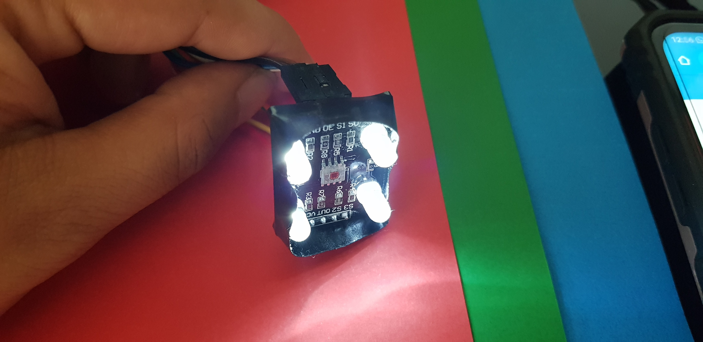
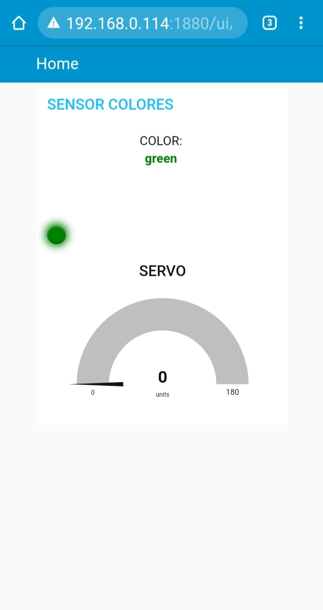

# :trophy: A5.2 Actividad de aprendizaje

Sistema sensor y actuacion del color de un objeto, e interface visual
___

## Instrucciones

- Realizar un sistema de identificacion de color utilizando un sensor de RGB TCS34725, un nodeMCU ESP32, un actuador Servomotor SG90, cualquier protocolo de comunicación y una interface visual que puede ser desarrollada por el equipo o apoyandose de otras como Node-red por ejemplo.
- Toda actividad o reto se deberá realizar utilizando el estilo **MarkDown con extension .md** y el entorno de desarrollo VSCode, debiendo ser elaborado como un documento **single page**, es decir si el documento cuanta con imágenes, enlaces o cualquier documento externo debe ser accedido desde etiquetas y enlaces, y debe ser nombrado con la nomenclatura **A5.2_NombreApellido_Equipo.pdf.**
- Es requisito que el .md contenga una etiqueta del enlace al repositorio de su documento en GITHUB, por ejemplo **Enlace a mi GitHub** y al concluir el reto se deberá subir a github.
- Desde el archivo **.md** exporte un archivo **.pdf** que deberá subirse a classroom dentro de su apartado correspondiente, sirviendo como evidencia de su entrega, ya que siendo la plataforma **oficial** aquí se recibirá la calificación de su actividad.
- Considerando que el archivo .PDF, el cual fue obtenido desde archivo .MD, ambos deben ser idénticos.
- Su repositorio ademas de que debe contar con un archivo **readme**.md dentro de su directorio raíz, con la información como datos del estudiante, equipo de trabajo, materia, carrera, datos del asesor, e incluso logotipo o imágenes, debe tener un apartado de contenidos o indice, los cuales realmente son ligas o **enlaces a sus documentos .md**, _evite utilizar texto_ para indicar enlaces internos o externo.
- Se propone una estructura tal como esta indicada abajo, sin embargo puede utilizarse cualquier otra que le apoye para organizar su repositorio.
  
```
- readme.md
  - blog
    - C5.1_TituloActividad.md
    - C5.2_TituloActividad.md    
  - img
  - docs
    - A5.1_TituloActividad.md
    - A5.2_TituloActividad.md    
```

___

## Desarrollo

1. Utilizar el siguiente listado de materiales para la elaboración de la actividad

| Cantidad | Descripción    |
| -------- | -------------- |
| 1        | [Sensor RGB TCS34725](https://uelectronics.com/producto/modulo-sensor-de-reconocimiento-de-color-rgb-tcs34725/) | 
| 1 |[Sensor de Color TCS230](https://www.naylampmechatronics.com/sensores-luz-y-sonido/139-modulo-sensor-de-color-tcs230.html)
| 1 | [Servomotor SG90](https://articulo.mercadolibre.com.mx/MLM-585222055-servomotor-micro-sg90-arduino-pic-raspberry-_JM#position=1&type=item&tracking_id=8ef8465a-5ee3-4453-a362-b3f6811e7c41)  |
| 1        |[Fuente de voltaje de  5V](https://www.amazon.com.mx/AC-DC-fuente-alimentaci%C3%B3n-Black/dp/B078RXZM4C/ref=asc_df_B078RXZM4C/?tag=gledskshopmx-20&linkCode=df0&hvadid=450926494212&hvpos=&hvnetw=g&hvrand=1295224076675663008&hvpone=&hvptwo=&hvqmt=&hvdev=c&hvdvcmdl=&hvlocint=&hvlocphy=9073855&hvtargid=pla-436418104506&psc=1)                                                                                                                             |
| 1        | [NodeMCU ESP32](https://www.amazon.com.mx/ESP-32-ESP-32S-ESP-WROOM-32-ESP32-S-desarrollo/dp/B07TBFC75Z/ref=sr_1_2?__mk_es_MX=%C3%85M%C3%85%C5%BD%C3%95%C3%91&dchild=1&keywords=esp32&qid=1599003438&sr=8-2)                |
| 1        | [BreadBoard](https://www.amazon.com.mx/Deke-Home-Breadboard-distribuci%C3%B3n-electr%C3%B3nica/dp/B086C9HK7V/ref=sr_1_22?__mk_es_MX=%C3%85M%C3%85%C5%BD%C3%95%C3%91&dchild=1&keywords=breadboard&qid=1599003455&sr=8-22)   |
| 1        | [Jumpers M/M](https://www.amazon.com.mx/ELEGOO-Macho-Hembra-Macho-Macho-Hembra-Hembra-Protoboard/dp/B06ZXSQ5WG/ref=sr_1_1?__mk_es_MX=%C3%85M%C3%85%C5%BD%C3%95%C3%91&dchild=1&keywords=jumper+wires&qid=1599003519&sr=8-1) |

2. Basado en las imágenes que se muestran en las **Figura 1**, realizar un sistema capaz de cumplir con las siguientes condiciones:
   
   - La primer fase de la actividad consistira en, al colocar un objeto frente al sensor RGB, este debera identificar que color tiene (es recomendable utiizar objetos de color Rojo, Verde, y Azul para mayor precision), el cual debera mostrar en un interface visual que color fue detectado.
   - La segunda fase, consistira en agregar un actuador que y un identificador de color apoyandose de una banda de colores como se muestra en la imagen 1; al conocer el color del objeto el actuador debera apuntar al color que se esta detectando.

 <p align="center"> 
    <strong>Figura 1 Circuito ESP32 Sensor de color y Servomotor</strong>
    
</p>

3. Coloque aquí la imagen del circuito ensamblado


4. Coloque en este lugar el programa creado dentro del entorno de Arduino
   
```arduino
#include <ESP32Servo.h>

// Sensor de Color
//
//    Arduino   TCS230 SENSOR COLOR
//      32         OUT
//      33         S3
//      25         S2
//      26         S1
//      27         S0
//      5V        VCC
//      GND       GND

//Objeto servo
Servo servo1;

//Declarar salidas
#define S0 27
#define S1 26
#define S2 25
#define S3 33
#define sensorSalida 32
#define servoPin 13

//Variables RGB
int Rojo_Frec = 0;
int Verde_Frec = 0;
int Azul_Frec = 0;

void setup() {
  //Pines RGB
  pinMode(S0, OUTPUT);
  pinMode(S1, OUTPUT);
  pinMode(S2, OUTPUT);
  pinMode(S3, OUTPUT);
  pinMode(sensorSalida, INPUT);

  digitalWrite(S0,HIGH);
  digitalWrite(S1,LOW);

  servo1.attach(servoPin);
  
  Serial.begin(9600);
}
void loop() {
// Configura el filtro ROJO para tomar lectura
  digitalWrite(S2,LOW);
  digitalWrite(S3,LOW);
  delay(100);
  Rojo_Frec= pulseIn(sensorSalida, LOW);
//  Serial.print(" R= "); Serial.print(Rojo_Frec);
  delay(100);
  
// Configura el filtro VERDE para tomar lectura
  digitalWrite(S2,HIGH);
  digitalWrite(S3,HIGH);
  delay(100);
  Verde_Frec = pulseIn(sensorSalida, LOW);
 // Serial.print(" V= "); Serial.print(Verde_Frec);
  delay(100);
  
// Configura el filtro AZUL para tomar lectura
  digitalWrite(S2,LOW);
  digitalWrite(S3,HIGH);
  delay(100);
  Azul_Frec = pulseIn(sensorSalida, LOW);
 // Serial.print(" A= "); Serial.print(Azul_Frec);
  delay(100);

//Rango de colores
if (Rojo_Frec < 100 && Verde_Frec > 250 && Azul_Frec > 200) //Rojo
{
  Serial.println(2); 
  servo1.write(0);  
}

else if (Rojo_Frec > 270 && Verde_Frec < 200 && Azul_Frec < 100) //Azul
{
  Serial.println(1); 
  servo1.write(90);
}

else if (Rojo_Frec > 280 && Verde_Frec < 250 && Azul_Frec < 300) //Verde
{
  Serial.println(0); 
  servo1.write(180);  
}

 delay(200);
}
```

5. Coloque aquí evidencias que considere importantes durante el desarrollo de la actividad.
- Evidencia fisica realizada por: Jose Alfredo Venegas Medina
- [Presentacion del circuito (VIDEO)](https://youtu.be/cA8BEC4rtnU) 




___




6. Para la demostracion de la actividad deberan utilizarse mas de un objeto para poder cubrir minimo tres colores.

7. Evidencia de reuniones

8. Conclusiones

- **Acevedo Ensiso Pedro Gabriel:**  


- **Ramirez Cervantes Cesar Manuel:**  


- **Venegas Medina Jose Alfredo:**  


- **Villalobos Perez Dulce Jasmin:**  

___

### :bomb: Rubrica

| Criterios     | Descripción                                                                                  | Puntaje |
| ------------- | -------------------------------------------------------------------------------------------- | ------- |
| Instrucciones | Se cumple con cada uno de los puntos indicados dentro del apartado Instrucciones?            | 10      |
| Desarrollo    | Se respondió a cada uno de los puntos solicitados dentro del desarrollo de la actividad?     | 60      |
| Demostración  | El alumno se presenta durante la explicación de la funcionalidad de la actividad?            | 20      |
| Conclusiones  | Se incluye una opinión personal de la actividad  por cada uno de los integrantes del equipo? | 10      |

___
**EQUIPO VERDE**  
**Acevedo Ensiso Pedro Gabriel:**   
:house: [Ir a mi Github](https://github.com/Gabriel123x/Sistemas_Programables.git)

**Ramirez Cervantes Cesar Manuel:**  
## :link: [Enlace a mi repositorio](https://github.com/CMRamirezC/Sistemas_Programables_Ramirez_Cervantes.git) :link:


**Venegas Medina Jose Alfredo:**   
:wolf: [Mi Github](https://github.com/Alfredopflc/Sistemas-Programables)

**Villalobos Perez Dulce Jasmin:**  
:house: :open_file_folder: [ENLACE - MI GITHUB](https://github.com/Villalobos39/SISTEMAS-PROGRAMABLES.git )