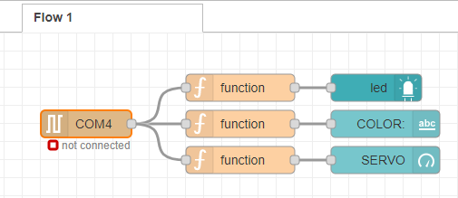

# :trophy: A5.2 Actividad de aprendizaje

Sistema sensor y actuacion del color de un objeto, e interface visual
___

## Instrucciones

- Realizar un sistema de identificacion de color utilizando un sensor de RGB TCS34725, un nodeMCU ESP32, un actuador Servomotor SG90, cualquier protocolo de comunicación y una interface visual que puede ser desarrollada por el equipo o apoyandose de otras como Node-red por ejemplo.
- Toda actividad o reto se deberá realizar utilizando el estilo **MarkDown con extension .md** y el entorno de desarrollo VSCode, debiendo ser elaborado como un documento **single page**, es decir si el documento cuanta con imágenes, enlaces o cualquier documento externo debe ser accedido desde etiquetas y enlaces, y debe ser nombrado con la nomenclatura **A5.2_NombreApellido_Equipo.pdf.**
- Es requisito que el .md contenga una etiqueta del enlace al repositorio de su documento en GITHUB, por ejemplo **Enlace a mi GitHub** y al concluir el reto se deberá subir a github.
- Desde el archivo **.md** exporte un archivo **.pdf** que deberá subirse a classroom dentro de su apartado correspondiente, sirviendo como evidencia de su entrega, ya que siendo la plataforma **oficial** aquí se recibirá la calificación de su actividad.
- Considerando que el archivo .PDF, el cual fue obtenido desde archivo .MD, ambos deben ser idénticos.
- Su repositorio ademas de que debe contar con un archivo **readme**.md dentro de su directorio raíz, con la información como datos del estudiante, equipo de trabajo, materia, carrera, datos del asesor, e incluso logotipo o imágenes, debe tener un apartado de contenidos o indice, los cuales realmente son ligas o **enlaces a sus documentos .md**, _evite utilizar texto_ para indicar enlaces internos o externo.
- Se propone una estructura tal como esta indicada abajo, sin embargo puede utilizarse cualquier otra que le apoye para organizar su repositorio.
  
```
- readme.md
  - blog
    - C5.1_TituloActividad.md
    - C5.2_TituloActividad.md    
  - img
  - docs
    - A5.1_TituloActividad.md
    - A5.2_TituloActividad.md    
```

___

## Desarrollo

1. Utilizar el siguiente listado de materiales para la elaboración de la actividad

| Cantidad | Descripción    |
| -------- | -------------- |
| 1        | [Sensor RGB TCS34725](https://uelectronics.com/producto/modulo-sensor-de-reconocimiento-de-color-rgb-tcs34725/) | 
| 1 |[Sensor de Color TCS230](https://www.naylampmechatronics.com/sensores-luz-y-sonido/139-modulo-sensor-de-color-tcs230.html)
| 1 | [Servomotor SG90](https://articulo.mercadolibre.com.mx/MLM-585222055-servomotor-micro-sg90-arduino-pic-raspberry-_JM#position=1&type=item&tracking_id=8ef8465a-5ee3-4453-a362-b3f6811e7c41)  |
| 1        |[Fuente de voltaje de  5V](https://www.amazon.com.mx/AC-DC-fuente-alimentaci%C3%B3n-Black/dp/B078RXZM4C/ref=asc_df_B078RXZM4C/?tag=gledskshopmx-20&linkCode=df0&hvadid=450926494212&hvpos=&hvnetw=g&hvrand=1295224076675663008&hvpone=&hvptwo=&hvqmt=&hvdev=c&hvdvcmdl=&hvlocint=&hvlocphy=9073855&hvtargid=pla-436418104506&psc=1)                                                                                                                             |
| 1        | [NodeMCU ESP32](https://www.amazon.com.mx/ESP-32-ESP-32S-ESP-WROOM-32-ESP32-S-desarrollo/dp/B07TBFC75Z/ref=sr_1_2?__mk_es_MX=%C3%85M%C3%85%C5%BD%C3%95%C3%91&dchild=1&keywords=esp32&qid=1599003438&sr=8-2)                |
| 1        | [BreadBoard](https://www.amazon.com.mx/Deke-Home-Breadboard-distribuci%C3%B3n-electr%C3%B3nica/dp/B086C9HK7V/ref=sr_1_22?__mk_es_MX=%C3%85M%C3%85%C5%BD%C3%95%C3%91&dchild=1&keywords=breadboard&qid=1599003455&sr=8-22)   |
| 1        | [Jumpers M/M](https://www.amazon.com.mx/ELEGOO-Macho-Hembra-Macho-Macho-Hembra-Hembra-Protoboard/dp/B06ZXSQ5WG/ref=sr_1_1?__mk_es_MX=%C3%85M%C3%85%C5%BD%C3%95%C3%91&dchild=1&keywords=jumper+wires&qid=1599003519&sr=8-1) |

2. Basado en las imágenes que se muestran en las **Figura 1**, realizar un sistema capaz de cumplir con las siguientes condiciones:
   
   - La primer fase de la actividad consistira en, al colocar un objeto frente al sensor RGB, este debera identificar que color tiene (es recomendable utiizar objetos de color Rojo, Verde, y Azul para mayor precision), el cual debera mostrar en un interface visual que color fue detectado.
   - La segunda fase, consistira en agregar un actuador que y un identificador de color apoyandose de una banda de colores como se muestra en la imagen 1; al conocer el color del objeto el actuador debera apuntar al color que se esta detectando.

 <p align="center"> 
    <strong>Figura 1 Circuito ESP32 Sensor de color y Servomotor</strong>
    
</p>

3. Coloque aquí la imagen del circuito ensamblado


4. Coloque en este lugar el programa creado dentro del entorno de Arduino
   
```arduino
#include <ESP32Servo.h>

// Sensor de Color
//
//     ESP32   TCS230 SENSOR COLOR
//      32         OUT
//      33         S3
//      25         S2
//      26         S1
//      27         S0
//      5V        VCC
//      GND       GND

//Objeto servo
Servo servo1;

//Declarar salidas
#define S0 27
#define S1 26
#define S2 25
#define S3 33
#define sensorSalida 32
#define servoPin 13

//Variables RGB
int Rojo_Frec = 0;
int Verde_Frec = 0;
int Azul_Frec = 0;

void setup() {
  //Pines RGB
  pinMode(S0, OUTPUT);
  pinMode(S1, OUTPUT);
  pinMode(S2, OUTPUT);
  pinMode(S3, OUTPUT);
  pinMode(sensorSalida, INPUT);

  digitalWrite(S0,HIGH);
  digitalWrite(S1,LOW);

  servo1.attach(servoPin);
  
  Serial.begin(9600);
}
void loop() {
// Configura el filtro ROJO para tomar lectura
  digitalWrite(S2,LOW);
  digitalWrite(S3,LOW);
  delay(100);
  Rojo_Frec= pulseIn(sensorSalida, LOW);
//  Serial.print(" R= "); Serial.print(Rojo_Frec);
  delay(100);
  
// Configura el filtro VERDE para tomar lectura
  digitalWrite(S2,HIGH);
  digitalWrite(S3,HIGH);
  delay(100);
  Verde_Frec = pulseIn(sensorSalida, LOW);
 // Serial.print(" V= "); Serial.print(Verde_Frec);
  delay(100);
  
// Configura el filtro AZUL para tomar lectura
  digitalWrite(S2,LOW);
  digitalWrite(S3,HIGH);
  delay(100);
  Azul_Frec = pulseIn(sensorSalida, LOW);
 // Serial.print(" A= "); Serial.print(Azul_Frec);
  delay(100);

//Rango de colores
if (Rojo_Frec < 100 && Verde_Frec > 250 && Azul_Frec > 200) //Rojo
{
  Serial.println(2); 
  servo1.write(0);  
}

else if (Rojo_Frec > 270 && Verde_Frec < 200 && Azul_Frec < 100) //Azul
{
  Serial.println(1); 
  servo1.write(90);
}

else if (Rojo_Frec > 280 && Verde_Frec < 250 && Azul_Frec < 300) //Verde
{
  Serial.println(0); 
  servo1.write(180);  
}

 delay(200);
}
```
**EXPORT JSON:** 
```json
[{"id":"e181518d.2ff","type":"tab","label":"Flow 1","disabled":false,"info":""},{"id":"ee4a5d6c.a4938","type":"serial in","z":"e181518d.2ff","name":"","serial":"1cd6a9cf.f68c16","x":70,"y":100,"wires":[["e0e57af2.209608","ea1206ab.63d928","73cba95.75f6458"]]},{"id":"e0e57af2.209608","type":"function","z":"e181518d.2ff","name":"","func":"\nif (msg.payload == 0)\n{\n   msg.color = \"green\"\n}\n\nif (msg.payload == 1)\n{\n    msg.color = \"blue\"\n}\n\nif (msg.payload == 2)\n{\n    msg.color = \"red\"\n}\n\nreturn msg;","outputs":1,"noerr":0,"initialize":"","finalize":"","x":240,"y":100,"wires":[["6f62daa6.bbe194"]]},{"id":"ea1206ab.63d928","type":"function","z":"e181518d.2ff","name":"","func":"msg.payload = Number(msg.payload);\nreturn msg;","outputs":1,"noerr":0,"initialize":"","finalize":"","x":240,"y":60,"wires":[["45a11fd.764f3e"]]},{"id":"6f62daa6.bbe194","type":"ui_text","z":"e181518d.2ff","group":"be86aa20.00ce98","order":1,"width":0,"height":0,"name":"","label":"COLOR:","format":"<font color= {{msg.color}} > {{color}} </font>","layout":"col-center","x":400,"y":100,"wires":[]},{"id":"45a11fd.764f3e","type":"ui_led","z":"e181518d.2ff","group":"be86aa20.00ce98","order":3,"width":0,"height":0,"label":"","labelPlacement":"left","labelAlignment":"left","colorForValue":[{"color":"green","value":"0","valueType":"num"},{"color":"blue","value":"1","valueType":"num"},{"color":"red","value":"2","valueType":"num"}],"allowColorForValueInMessage":false,"name":"","x":390,"y":60,"wires":[]},{"id":"cde9278f.0f96c8","type":"ui_gauge","z":"e181518d.2ff","name":"","group":"be86aa20.00ce98","order":4,"width":0,"height":0,"gtype":"gage","title":"SERVO","label":"units","format":"{{value}}","min":0,"max":"180","colors":["#00b500","#0f00e6","#ca3838"],"seg1":"","seg2":"","x":400,"y":140,"wires":[]},{"id":"73cba95.75f6458","type":"function","z":"e181518d.2ff","name":"","func":"if (msg.payload == 0)\n{\n   msg.payload = 0\n}\n\nif (msg.payload == 1)\n{\n    msg.payload = 90\n}\n\nif (msg.payload == 2)\n{\n    msg.payload = 180\n}\n\nmsg.payload = Number(msg.payload);\nreturn msg;","outputs":1,"noerr":0,"initialize":"","finalize":"","x":240,"y":140,"wires":[["cde9278f.0f96c8"]]},{"id":"1cd6a9cf.f68c16","type":"serial-port","serialport":"COM4","serialbaud":"9600","databits":"8","parity":"none","stopbits":"1","waitfor":"","dtr":"none","rts":"none","cts":"none","dsr":"none","newline":"\\n","bin":"false","out":"char","addchar":"","responsetimeout":"10000"},{"id":"be86aa20.00ce98","type":"ui_group","name":"SENSOR COLORES","tab":"8aba05b6.947e18","order":1,"disp":true,"width":"6","collapse":false},{"id":"8aba05b6.947e18","type":"ui_tab","name":"Home","icon":"dashboard","order":1,"disabled":false,"hidden":false}]
```

5. Coloque aquí evidencias que considere importantes durante el desarrollo de la actividad.
- Evidencia fisica realizada por: Jose Alfredo Venegas Medina
- [Presentacion del circuito (VIDEO)](https://youtu.be/cA8BEC4rtnU) 


___



6. Para la demostracion de la actividad deberan utilizarse mas de un objeto para poder cubrir minimo tres colores.

7. Evidencia de reuniones


8. Conclusiones

- **Acevedo Ensiso Pedro Gabriel:**  
Dentro de la realización de esta práctica comprendí mejor el funcionamiento de un sistema de detección de colores, el cual puedo ver con mejor claridad qué es lo que se necesita para ser implementado correctamente. Un sistema detector de colores puede ser una buena forma de automatizar muchos procesos industriales dentro de una fábrica tales como la organización de materiales hasta la automatización de montaje y ensamblado de elementos que posiblemente sean muy complicados para ser manejados por seres humanos. Podemos implementar por ejemplo un sistema detector de colores en un campo de cultivo con lo cual podemos separar correctamente las distintas frutas recolectadas basándose en su color. Con esto finalmente comprendo mejor las complicaciones que pueden existir al no tener bien calibrado un sistema como este ya que de no hacerlo correctamente podemos tener muchos errores los cuales pueden costarle mucho dinero a la empresa donde laboramos.

- **Ramirez Cervantes Cesar Manuel:**  
En esta práctica con ayuda de un sensor RGB TCS34725 se realizó un circuito capaz de identificar el color de un objeto, utilizando objetos en este caso hojas de los colores principales del RGB para su mayor precisión. Una vez que el sensor detecta el color de dicho objeto envía esa información al ESP32 para que esté a su vez por medio de un actuador Servomotor SG90 indique visualmente que color es el que reconoció el sensor RGB lo interesante de esta práctica es que esta información de que color es el que está identificando el sensor RGB se va a mostrar en tiempo real en una interfaz web mostrando el color inclusive en nuestro caso muestra el lado hacia donde apunta el servomotor. Por esté motivo sistemas detectores de color son muy utilizados en procesos industriales ya que con ellos podemos automatizar mejor los procesos de producción porque nos permiten reconocer patrones de una manera automática.

- **Venegas Medina Jose Alfredo:**  
En esta práctica se realizó un circuito capaz de detectar 3 colores, el rojo, azul y verde utilizando un sensor capaz de medir frecuencias de colores, y un motor que se movería indicando en color detectado. Además de una página creada en Node-red la cual evalúa los distintos cambios de color que el sensor detecte. Si bien, esta fue una práctica laboriosa ya que se debían realizar diferentes puntos con los conocimientos previos de las anteriores practicas se pudieron resolver con facilidad. Por otro lado, los sensores de color son realmente utilizados en las industrias de fabricación y transporte de producto clasificándolos por colores. Podría ser desde el color de la tapa, etiqueta, por el color del producto e incluso verificando el sello de calidad. Ejemplo de esto serían las piezas de juguetes como las de lego, las cuales, aunque muchas sean iguales entre sí, es necesario que sean de distintos colores para los distintos sets. Otra aplicación seria a la hora de seleccionar algunos productos alimenticios o de dulce como los panditas, M&M'S y los Skittles los cuales, dependiendo de su producto pueden variar los colores de estos. Así, en estos casos de la industria, el servomotor podría utilizarse para separar los productos por color.

- **Villalobos Perez Dulce Jasmin:**  
En esta práctica se utilizó un sensor RGB, con el objetivo principal de identificar el color qué se pone de bajo del sensor, por ejemplo al poner una hoja o cartulina de color el sensor determinaría qué color tiene, esto es posible ya qué el sensor puede detectar una serie de combinaciones de colores a partir de la información a través de la luz, utilizando tres sensores acoplados que realizan la separación de la luz qué concuerdan con los colores rojo, verde y azul. Principalmente para lograr esto mi compañero tuvo qué identificar cuál era su frecuencia de color, cuando de vínculo la conexión con el nodeRed, para trabajar con la interfaz gráfica y se pueda ver el resultado en pantalla, se envió un mensaje con un valor, este valor se convirtió en un entero para qué sea más fácil de identificar, por ejemplo si se recibe un 2 es rojo, un 1 es azul y si es cero entonces es verde. Cuando se utilizó el servomotor se puso la condición de qué si es rojo o sea el valor 0 la aguja del servomotor giraría 180 grados, si es verde regresaría o permanecería en 0 grados, y cuando es azul esta se posiciona en los 90 grados. De esta manera se mostró tanto en la interfaz gráfica como en la representación con el servomotor. Como se vio este sensor RGB se puede aplicar en una línea de producción por ejemplo al detectar el color de las bolsas de empaquetado, si todas son del mismo o se filtra una de un color diferente al de la línea principal.
___

### :bomb: Rubrica

| Criterios     | Descripción                                                                                  | Puntaje |
| ------------- | -------------------------------------------------------------------------------------------- | ------- |
| Instrucciones | Se cumple con cada uno de los puntos indicados dentro del apartado Instrucciones?            | 10      |
| Desarrollo    | Se respondió a cada uno de los puntos solicitados dentro del desarrollo de la actividad?     | 60      |
| Demostración  | El alumno se presenta durante la explicación de la funcionalidad de la actividad?            | 20      |
| Conclusiones  | Se incluye una opinión personal de la actividad  por cada uno de los integrantes del equipo? | 10      |

___
**EQUIPO VERDE**  
**Acevedo Ensiso Pedro Gabriel:**   
:house: [Ir a mi Github](https://github.com/Gabriel123x/Sistemas_Programables.git)

**Ramirez Cervantes Cesar Manuel:**  
## :link: [Enlace a mi repositorio](https://github.com/CMRamirezC/Sistemas_Programables_Ramirez_Cervantes.git) :link:


**Venegas Medina Jose Alfredo:**   
:wolf: [Mi Github](https://github.com/Alfredopflc/Sistemas-Programables)

**Villalobos Perez Dulce Jasmin:**  
:house: :open_file_folder: [ENLACE - MI GITHUB](https://github.com/Villalobos39/SISTEMAS-PROGRAMABLES.git )